# Docs video shortlist

Generated from the [full X video audit](VIDEO_AUDIT.md), which contains 94 public video posts.

## Recommendation

Videos 1–11 are approved for docs. Videos 12–14 still need review. Keep 7 as reserves, and leave the remaining 73 out of the docs.

- Put task-matched recordings in tutorials and how-to guides.
- Put capability proofs and product animations in explanation or overview pages.
- Avoid reaction GIFs, launch teasers, unrelated personal posts, and older product surfaces unless a page needs historical context.
- Keep one strong recording per claim. Repeating the same clip on the docs index and a task page makes both pages heavier.

The clearest immediate change is to replace the Windows piano video in **Drive your first app** with the Linux calculator QA loop. The tutorial asks the user to drive a calculator, so its preview should show that task.

The current Fumadocs content tree has no Cua-Bench MDX page. Add an overview page before embedding Cua-Bench launch or results clips.

## Approved for docs

### 1. Calculator build and QA loop on Linux

[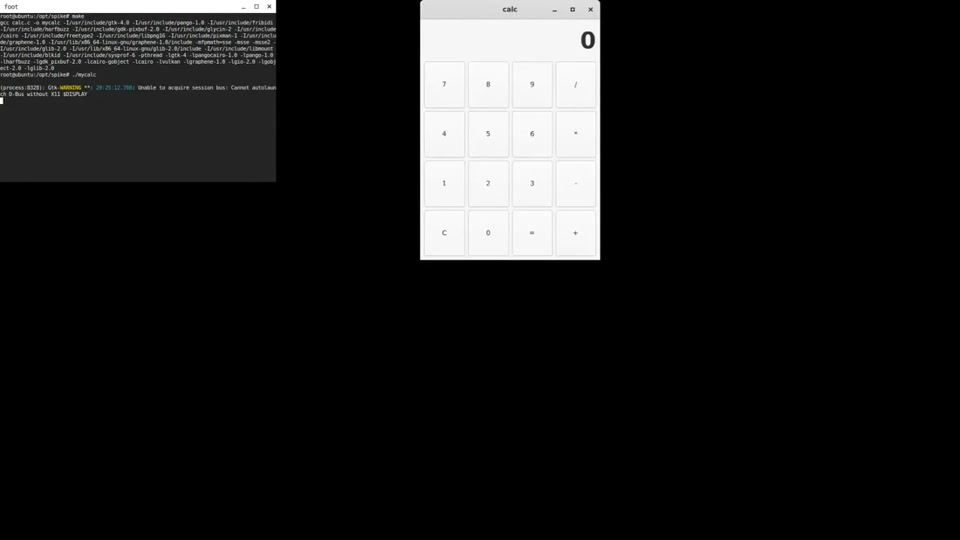](https://video.twimg.com/amplify_video/2067633385477111809/vid/avc1/1100x618/-Zg-HqPeUdErYRdB.mp4)

- Product: Cua Driver
- Docs role: Tutorial
- Best placement: [Drive your first app](https://cua.ai/docs/tutorials/drive-your-first-app)
- Decision: Replace the piano preview. This recording matches the calculator task and shows the agent terminal staying in front.
- Recording: 0:25, 1100×618
- Source: [@trycua post 2067639342944985586](https://x.com/trycua/status/2067639342944985586)

### 2. Chrome playback without foregrounding the browser

[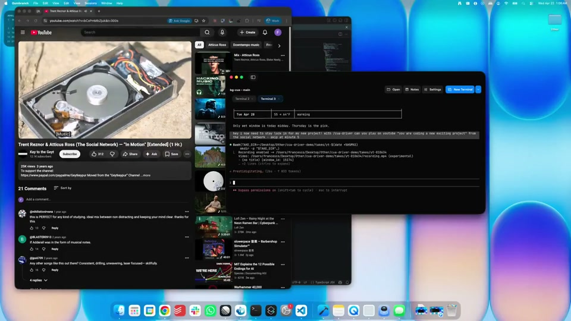](https://video.twimg.com/amplify_video/2047379829042065408/vid/avc1/1280x720/te2UgRiP_4gm8Giu.mp4)

- Product: Cua Driver
- Docs role: How-to guide
- Best placement: [Drive a web page](https://cua.ai/docs/how-to-guides/driver/drive-a-web-page)
- Decision: Keep. The recording proves the page-specific claim in 13 seconds.
- Recording: 0:13, 1280×720
- Source: [@trycua post 2047383209244287350](https://x.com/trycua/status/2047383209244287350)

### 3. Record and render a zoom-on-click trajectory

[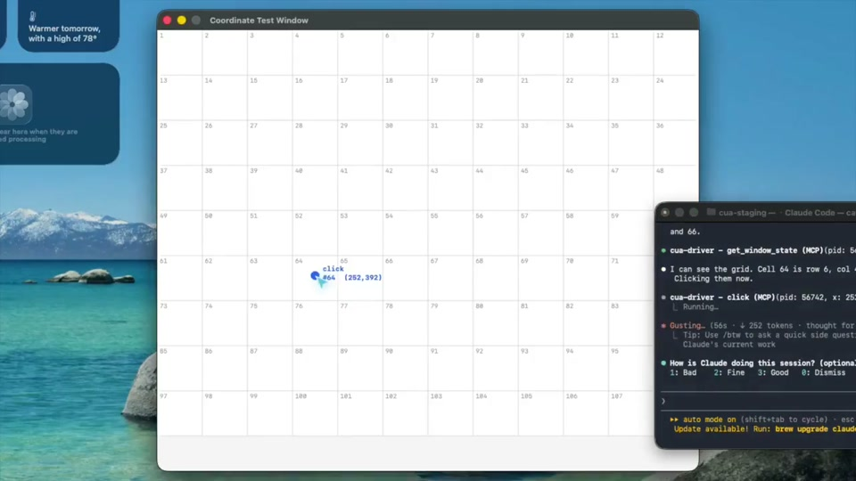](https://video.twimg.com/amplify_video/2047379960906883072/vid/avc1/1280x720/_jOaJRNzaCA2SMXu.mp4)

- Product: Cua Driver
- Docs role: How-to guide
- Best placement: [Record and render a trajectory](https://cua.ai/docs/how-to-guides/driver/record-and-render-a-trajectory)
- Decision: Keep. It shows the exact output that the guide teaches users to produce.
- Recording: 0:19, 1280×720
- Source: [@trycua post 2047383207612645426](https://x.com/trycua/status/2047383207612645426)

### 4. Build a spreadsheet over SSH on headless Linux

[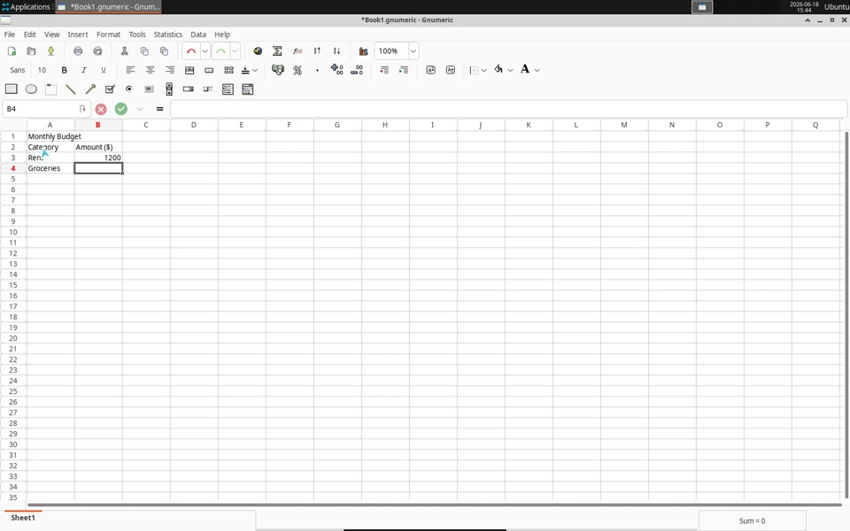](https://video.twimg.com/amplify_video/2067635305172336640/vid/avc1/1600x1000/1vqaHBn2lqWK1DT5.mp4)

- Product: Cua Driver
- Docs role: How-to guide
- Best placement: A new Linux-over-SSH guide or the docs overview
- Decision: Use. The task, remote environment, and finished spreadsheet are clear, and the 35-second length works in docs.
- Recording: 0:35, 1600×1000
- Source: [@trycua post 2067639346719826213](https://x.com/trycua/status/2067639346719826213)

### 5. Build, inspect, fix, and QA a WPF app

- Product: Cua Driver
- Docs role: How-to guide
- Best placement: A Windows coding-agent recipe or the docs overview
- Decision: Use when the page explains the full coding-agent loop. The recording is too long for a first-run tutorial.
- Recording: 2:37, 1280×720
- Source: [@trycua post 2059688966085853245](https://x.com/trycua/status/2059688966085853245)

### 6. Fix and QA an app while the terminal stays in front

[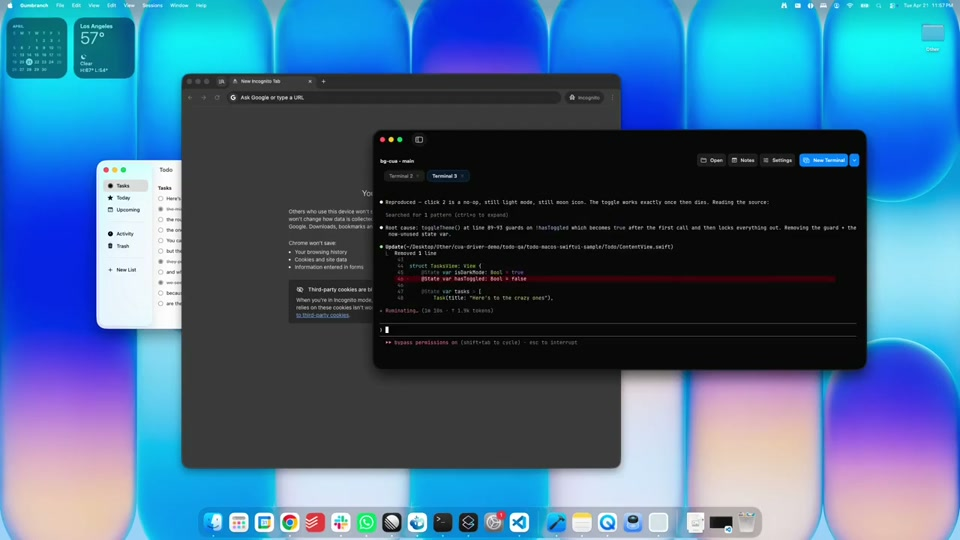](https://video.twimg.com/amplify_video/2047379490725416960/vid/avc1/1280x720/Jad8fBv6lY_gC56V.mp4)

- Product: Cua Driver
- Docs role: Explanation
- Best placement: [Best-effort background](https://cua.ai/docs/concepts/the-no-foreground-contract)
- Decision: Use as the practical proof for the background-delivery explanation. Keep it below the concise pointer clips.
- Recording: 1:45, 1280×720
- Source: [@trycua post 2047383205444251889](https://x.com/trycua/status/2047383205444251889)

### 7. Four Hermes agents drive four Windows app windows

[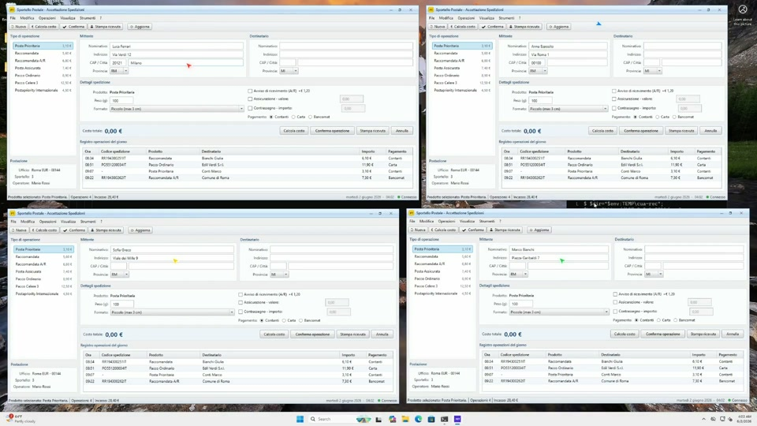](https://video.twimg.com/amplify_video/2061704846185840640/vid/avc1/1920x1080/L25lMMtkcmiVukk_.mp4)

- Product: Cua Driver
- Docs role: Explanation
- Best placement: A new agent-cursors section in the process-model or background-delivery docs
- Decision: Use. Four scoped cursors and four windows make session ownership understandable at a glance.
- Recording: 0:22, 1920×1080
- Source: [@francedot post 2061706670208897279](https://x.com/francedot/status/2061706670208897279)

### 8. Several synthetic pointers on XFCE

[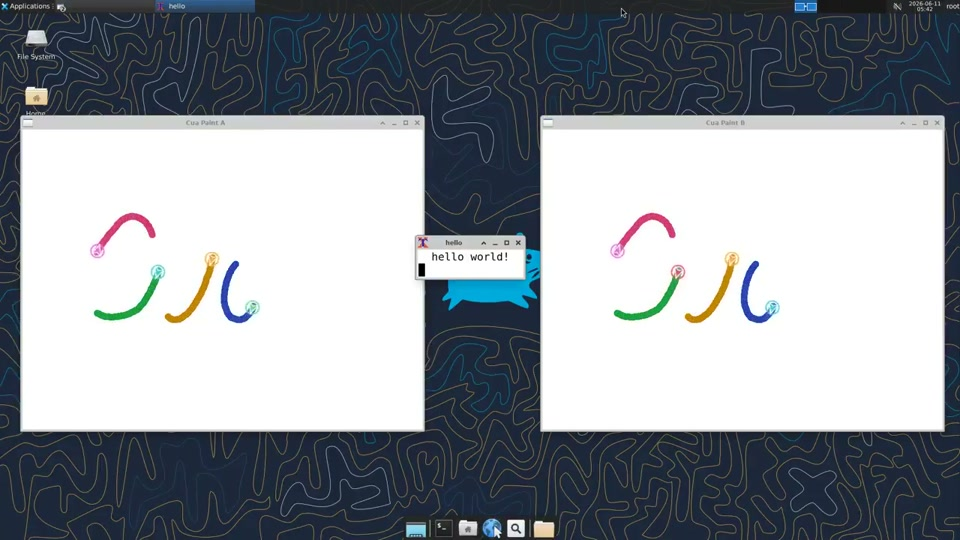](https://video.twimg.com/amplify_video/2067633339243401216/vid/avc1/1280x720/Azw9Hq-dT5lh2aSP.mp4)

- Product: Cua Driver
- Docs role: Explanation
- Best placement: [Best-effort background](https://cua.ai/docs/concepts/the-no-foreground-contract)
- Decision: Keep. It is the shortest clear proof that agent cursors do not move the user pointer.
- Recording: 0:03, 1280×720
- Source: [@trycua post 2067639340738761015](https://x.com/trycua/status/2067639340738761015)

### 9. Sixteen independent cursors on Wayland

[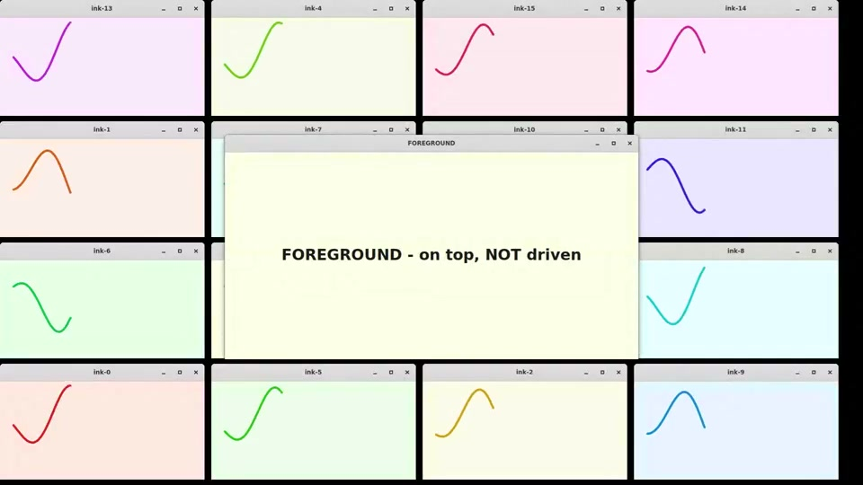](https://video.twimg.com/amplify_video/2067633453122879488/vid/avc1/960x540/61AOnEQ5cj582y2R.mp4)

- Product: Cua Driver
- Docs role: Explanation
- Best placement: [Best-effort background](https://cua.ai/docs/concepts/the-no-foreground-contract)
- Decision: Keep next to the XFCE clip as platform and concurrency evidence.
- Recording: 0:07, 960×540
- Source: [@trycua post 2067639344698179789](https://x.com/trycua/status/2067639344698179789)

### 10. Automate a legacy Windows postal app

[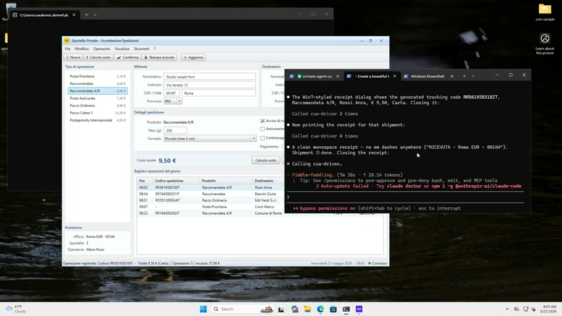](https://video.twimg.com/amplify_video/2059693201644978180/vid/avc1/1280x720/jKXB1bMW8aRG0dWs.mp4)

- Product: Cua Driver
- Docs role: How-to guide
- Best placement: [Automate a legacy Windows app behind a VPN](https://cua.ai/docs/how-to-guides/recipes/automate-a-legacy-windows-app-behind-a-vpn)
- Decision: Keep on this exact recipe. The edited version is clearer than the shorter original, though its five-minute length limits reuse.
- Recording: 5:27, 1280×720
- Source: [@trycua post 2059693301276565841](https://x.com/trycua/status/2059693301276565841)

### 11. Open-source Cua-Bench task registry and runner

[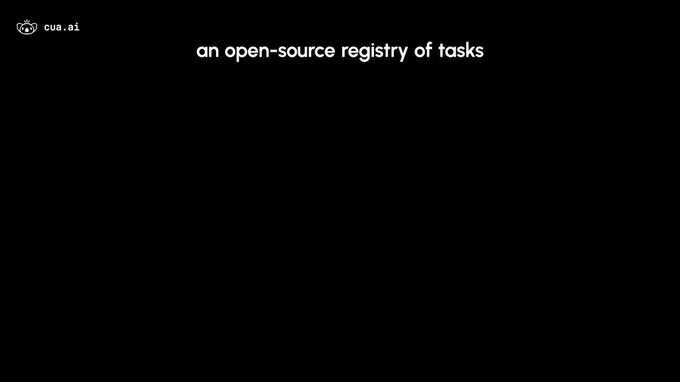](https://video.twimg.com/amplify_video/2014406126427860992/vid/avc1/1920x1080/dD5JFwLEV78gjTOP.mp4)

- Product: Cua-Bench
- Docs role: Explanation
- Best placement: A future Cua-Bench overview page
- Decision: Use as the main Cua-Bench explainer. It covers tasks, variations, adapters, the CLI, and self-hosting.
- Recording: 0:50, 1920×1080
- Source: [@trycua post 2014406820887183512](https://x.com/trycua/status/2014406820887183512)

## Needs review

### 12. Cua-Bench KiCad launch animation

[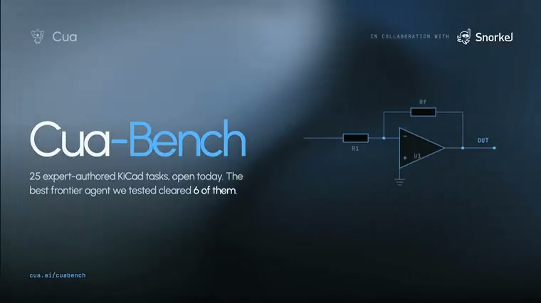](https://video.twimg.com/tweet_video/HK38bqRa4AAFy-m.mp4)

- Product: Cua-Bench
- Docs role: Overview
- Best placement: The top of a future Cua-Bench overview page
- Decision: Use as a short product identifier beside concrete benchmark text. It is an animation, so it should not stand in for a workflow demo.
- Recording: 0:04, 760×426
- Source: [@trycua post 2066597808132776150](https://x.com/trycua/status/2066597808132776150)

### 13. Gemini 3.5 Flash Cua-Bench result card

[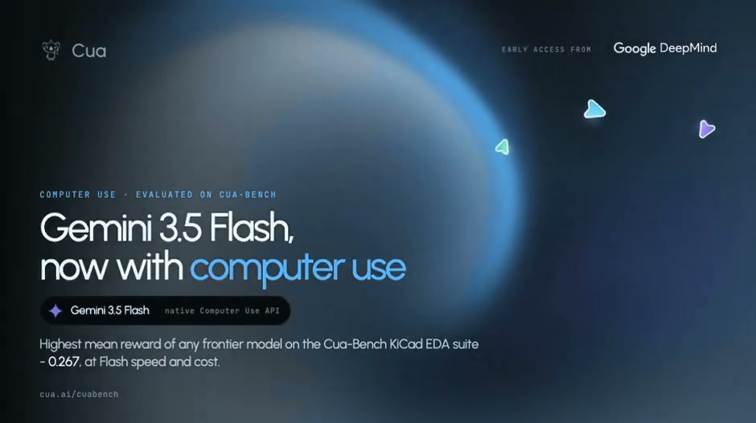](https://video.twimg.com/tweet_video/HLl7gQwaUAAHyHC.mp4)

- Product: Cua-Bench
- Docs role: Reference or results note
- Best placement: A Cua-Bench results page or model-evaluation example
- Decision: Use only with the dated score and test-suite context. The clip communicates the result rather than the benchmark procedure.
- Recording: 0:06, 940×526
- Source: [@trycua post 2069827307490172981](https://x.com/trycua/status/2069827307490172981)

### 14. Prompt an agent in a Cua cloud sandbox

[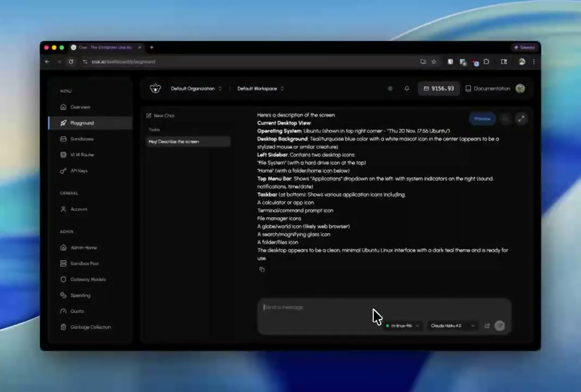](https://video.twimg.com/amplify_video/1991596003212787712/vid/avc1/1068x720/A5gkbVkgn5XkXWm5.mp4)

- Product: Cua
- Docs role: Tutorial
- Best placement: [Your first cloud sandbox](https://cua.ai/docs/tutorials/your-first-cloud-sandbox)
- Decision: Use if the current dashboard still matches the recording. It shows the prompt, desktop, and tool-call view together.
- Recording: 0:38, 1068×720
- Source: [@trycua post 1991598760020045950](https://x.com/trycua/status/1991598760020045950)

## Reserve

| Preview | Post | Why it is a reserve |
| --- | --- | --- |
| [Midpoint frame](public/audits/x-videos/frames/francedot/2062231318294131130-1.jpg) | [2062231318294131130](https://x.com/francedot/status/2062231318294131130) | Strong landing-page spectacle, but the piano task does not match the calculator tutorial and teaches no repeatable workflow. |
| [Midpoint frame](public/audits/x-videos/frames/trycua/2047383211026886709-1.jpg) | [2047383211026886709](https://x.com/trycua/status/2047383211026886709) | Good proof of background Messages automation, but the two-minute personal-assistant scenario lacks a dedicated docs page. |
| [Midpoint frame](public/audits/x-videos/frames/francedot/2061706672377397735-1.jpg) | [2061706672377397735](https://x.com/francedot/status/2061706672377397735) | Detailed agent-cursors explanation, but the 2:36 runtime repeats the clearer 21-second four-window clip. |
| [Midpoint frame](public/audits/x-videos/frames/trycua/2000972986090709370-1.jpg) | [2000972986090709370](https://x.com/trycua/status/2000972986090709370) | Useful historical Cua-Bench explanation. Prefer the newer open-source overview for current docs. |
| [Midpoint frame](public/audits/x-videos/frames/trycua/1973799068263723050-1.jpg) | [1973799068263723050](https://x.com/trycua/status/1973799068263723050) | A clear benchmark comparison that can support a page about reading results, but it uses an older model comparison. |
| [Midpoint frame](public/audits/x-videos/frames/trycua/1961443982350635182-1.jpg) | [1961443982350635182](https://x.com/trycua/status/1961443982350635182) | The human-in-the-loop UI is clear. Hold until the current product has a matching handoff guide. |
| [Midpoint frame](public/audits/x-videos/frames/trycua/1952774028726272477-1.jpg) | [1952774028726272477](https://x.com/trycua/status/1952774028726272477) | The TypeScript and cloud-desktop flow is clear, but the older Playground UI and API need a currentness check. |

## Explicit rejection

- [Post 2069827325244608881](https://x.com/trycua/status/2069827325244608881) says the agent drives a KiCad task, but the midpoint shows a Zone Lighting grid. Do not place it on a KiCad or Cua-Bench task page without checking the complete recording and correcting the caption.
- Do not use the 3:37 “Don’t Stop Me Now” piano recording when the 44-second piano edit exists.
- Leave low-resolution reactions and one-second reply GIFs in the full audit. They add no product instruction.
