# X video audit

Generated 2026-07-18T12:10:46.705Z.

## Coverage

- Profiles: `@trycua` and `@francedot`.
- Source: each public X media timeline (including replies), enumerated through Nitter and resolved through X’s public syndication endpoint.
- Included: original posts and replies with directly attached video or animated-GIF media.
- Excluded: reposts, photos, and videos that appear only inside quoted posts.
- Deleted, protected, or otherwise non-public posts cannot be audited.
- Total video media items: 94, including 47 posted as replies.
- Unresolved public video candidates: 0.
- Click a midpoint frame to open the highest-resolution MP4 on X’s CDN.

| Profile | Media posts inspected | Video posts | Video media | Reply media | Stop reason |
| --- | ---: | ---: | ---: | ---: | --- |
| @trycua | 108 | 40 | 40 | 15 | end-of-public-media-timeline |
| @francedot | 329 | 54 | 54 | 32 | end-of-public-media-timeline |

## @trycua

[Public media timeline used for discovery](https://nitter.kareem.one/trycua/media)

### 2026-06-24 · reply · [Post 2069827325244608881](https://x.com/trycua/status/2069827325244608881)

> 7/ Here's a demo our team recorded of Gemini 3.5 Flash driving a real KiCad task, via the @antigravity (agy) CLI and Cua Driver. https://t.co/s8bjtm72k7

[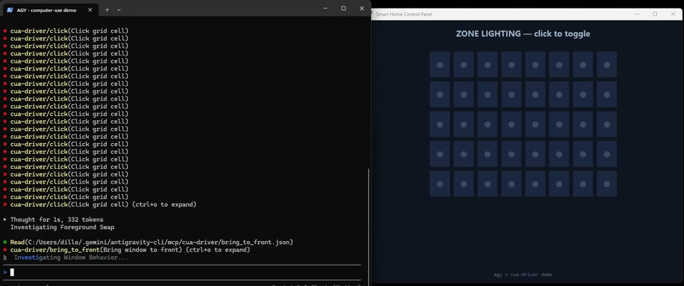](https://video.twimg.com/amplify_video/2069821927074799616/vid/avc1/1720x720/d3Jfov2jaFhh5rT1.mp4)

- Media 1: [highest-resolution MP4](https://video.twimg.com/amplify_video/2069821927074799616/vid/avc1/1720x720/d3Jfov2jaFhh5rT1.mp4)
- Resolution: 1720×720 · Duration: 1:35 · Type: video
- [Original X poster](https://pbs.twimg.com/amplify_video_thumb/2069821927074799616/img/AJEkVeEKAyCJVwdz.jpg)

### 2026-06-24 · [Post 2069827307490172981](https://x.com/trycua/status/2069827307490172981)

> 1/ We had early access from @GoogleDeepMind to Gemini 3.5 Flash's native Computer Use. On Cua-Bench it posted the highest mean reward of any frontier model we tested - 0.267, on KiCad tasks no model fully solves. At Flash speed and cost. https://t.co/Hm01NEuOAv

- Media 1: [highest-resolution MP4](https://video.twimg.com/tweet_video/HLl7gQwaUAAHyHC.mp4)
- Resolution: 940×526 · Duration: 0:06 · Type: animated_gif
- [Original X poster](https://pbs.twimg.com/tweet_video_thumb/HLl7gQwaUAAHyHC.jpg)

### 2026-06-18 · reply · [Post 2067639346719826213](https://x.com/trycua/status/2067639346719826213)

> 6/ Headless agent over SSH builds a working budget in a real Linux spreadsheet on a remote box with no GPU and no display attached https://t.co/QbC8jKy6MN

- Media 1: [highest-resolution MP4](https://video.twimg.com/amplify_video/2067635305172336640/vid/avc1/1600x1000/1vqaHBn2lqWK1DT5.mp4)
- Resolution: 1600×1000 · Duration: 0:35 · Type: video
- [Original X poster](https://pbs.twimg.com/amplify_video_thumb/2067635305172336640/img/62bV-2E7LuEyYIAt.jpg)

### 2026-06-18 · reply · [Post 2067639344698179789](https://x.com/trycua/status/2067639344698179789)

> 5/ Wayland multi-window control, in preview. Cua Driver drives 16 cursors across 16 Wayland windows at the same time, each one moving independently. https://t.co/qdz70RyQbC

- Media 1: [highest-resolution MP4](https://video.twimg.com/amplify_video/2067633453122879488/vid/avc1/960x540/61AOnEQ5cj582y2R.mp4)
- Resolution: 960×540 · Duration: 0:07 · Type: video
- [Original X poster](https://pbs.twimg.com/amplify_video_thumb/2067633453122879488/img/OqG5pYLLRaut2MPX.jpg)

### 2026-06-18 · reply · [Post 2067639342944985586](https://x.com/trycua/status/2067639342944985586)

> 4/ Background dev loop. Claude Code builds a calculator app, drives the calculator UI, QAs its own work. The agent terminal stayed frontmost the whole time https://t.co/6wqF1ak1dL

- Media 1: [highest-resolution MP4](https://video.twimg.com/amplify_video/2067633385477111809/vid/avc1/1100x618/-Zg-HqPeUdErYRdB.mp4)
- Resolution: 1100×618 · Duration: 0:25 · Type: video
- [Original X poster](https://pbs.twimg.com/amplify_video_thumb/2067633385477111809/img/7Q_qNkKr3XqBe13V.jpg)

### 2026-06-18 · reply · [Post 2067639340738761015](https://x.com/trycua/status/2067639340738761015)

> 3/ True multi synthetic pointer support. Cua Driver drives several cursors dragging the word "Cua" across XFCE at the same time. Main window stays frontmost. https://t.co/qVAwZNfd1W

- Media 1: [highest-resolution MP4](https://video.twimg.com/amplify_video/2067633339243401216/vid/avc1/1280x720/Azw9Hq-dT5lh2aSP.mp4)
- Resolution: 1280×720 · Duration: 0:03 · Type: video
- [Original X poster](https://pbs.twimg.com/amplify_video_thumb/2067633339243401216/img/YzbdaelkpEIDyck2.jpg)

### 2026-06-18 · [Post 2067639336703775037](https://x.com/trycua/status/2067639336703775037)

> 1/ Today we're bringing Cua Driver to Linux: background computer-use for any agent. Hermes, Claude Code, Codex, or your own loop can drive real Linux desktop apps (X and Wayland in preview) through CLI or MCP while your desktop stays usable https://t.co/TyRNz4NBC9

[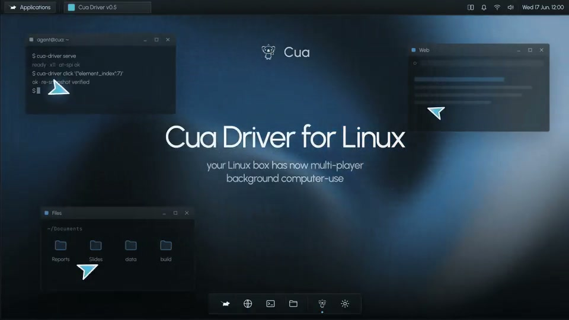](https://video.twimg.com/tweet_video/HLGugHQbwAAja6u.mp4)

- Media 1: [highest-resolution MP4](https://video.twimg.com/tweet_video/HLGugHQbwAAja6u.mp4)
- Resolution: 960×540 · Duration: 0:08 · Type: animated_gif
- [Original X poster](https://pbs.twimg.com/tweet_video_thumb/HLGugHQbwAAja6u.jpg)

### 2026-06-15 · [Post 2066597808132776150](https://x.com/trycua/status/2066597808132776150)

> 1/ Today we're launching Cua-Bench with @SnorkelAI: a benchmark for computer-use agents on professional software, open for any model to run. The benchmark covers 25 expert-authored KiCad tasks, and the best frontier model we tested cleared only 6 of them. https://t.co/AM7EIotW6F

- Media 1: [highest-resolution MP4](https://video.twimg.com/tweet_video/HK38bqRa4AAFy-m.mp4)
- Resolution: 760×426 · Duration: 0:04 · Type: animated_gif
- [Original X poster](https://pbs.twimg.com/tweet_video_thumb/HK38bqRa4AAFy-m.jpg)

### 2026-06-10 · [Post 2064744390615343480](https://x.com/trycua/status/2064744390615343480)

> 1/2 The Cua team is excited to join @aiDotEngineer World’s Fair on July 1 in SF to talk Computer-Use 2.0. CUAs are moving beyond screenshot + cursor loops toward window-scoped loops orchestrated by coding agents. We’ll share what changed and what becomes possible next. https://t.co/UCTBn8tfg9

[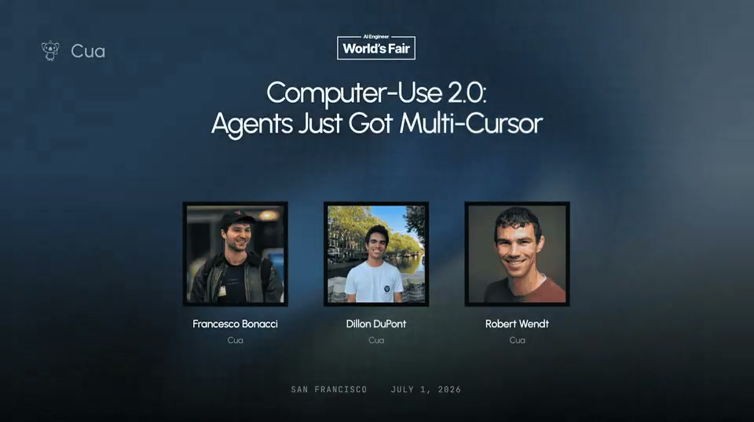](https://video.twimg.com/tweet_video/HKdvSNGa8AAuSF_.mp4)

- Media 1: [highest-resolution MP4](https://video.twimg.com/tweet_video/HKdvSNGa8AAuSF_.mp4)
- Resolution: 960×538 · Duration: 0:09 · Type: animated_gif
- [Original X poster](https://pbs.twimg.com/tweet_video_thumb/HKdvSNGa8AAuSF_.jpg)

### 2026-05-27 · reply · [Post 2059693301276565841](https://x.com/trycua/status/2059693301276565841)

> ^ EDITED https://t.co/14pm2qHOPF

- Media 1: [highest-resolution MP4](https://video.twimg.com/amplify_video/2059693201644978180/vid/avc1/1280x720/jKXB1bMW8aRG0dWs.mp4)
- Resolution: 1280×720 · Duration: 5:27 · Type: video
- [Original X poster](https://pbs.twimg.com/amplify_video_thumb/2059693201644978180/img/_AvWfXLcuStvWSlr.jpg)

### 2026-05-27 · reply · [Post 2059688969080557955](https://x.com/trycua/status/2059688969080557955)

> Legacy Windows automation. We drove an old mail-service desktop app with no API. The kind of software that still runs real operations inside enterprises, governments, logistics, healthcare, and finance. For apps like this, the desktop window is the interface.  4/6 https://t.co/EM1iyJcZgM

- Media 1: [highest-resolution MP4](https://video.twimg.com/amplify_video/2059682976049336323/vid/avc1/1280x720/HUICKyvVjKLrzoVZ.mp4)
- Resolution: 1280×720 · Duration: 2:37 · Type: video
- [Original X poster](https://pbs.twimg.com/amplify_video_thumb/2059682976049336323/img/p90T4xWUnPicyEGL.jpg)

### 2026-05-27 · reply · [Post 2059688966085853245](https://x.com/trycua/status/2059688966085853245)

> Coding agent QA loop. Prompt: "build a beautiful WPF app and make sure it works."  Claude Code wrote the app, launched it, inspected the real Windows UI, found rough edges, fixed them, QA'd the result, then had Cua record the demo.  3/6 https://t.co/mQq2Te3pfA

- Media 1: [highest-resolution MP4](https://video.twimg.com/amplify_video/2059682762781560834/vid/avc1/1280x720/GTmf25E5B9XqbXkc.mp4)
- Resolution: 1280×720 · Duration: 2:37 · Type: video
- [Original X poster](https://pbs.twimg.com/amplify_video_thumb/2059682762781560834/img/XxaxS_qC4z3Gbwko.jpg)

### 2026-04-23 · reply · [Post 2047383211026886709](https://x.com/trycua/status/2047383211026886709)

> Personal assistant. Agent fires off a Messages reply while I keep typing in my editor. The Space never switches.  7/8 https://t.co/6KzxE5bC5d

[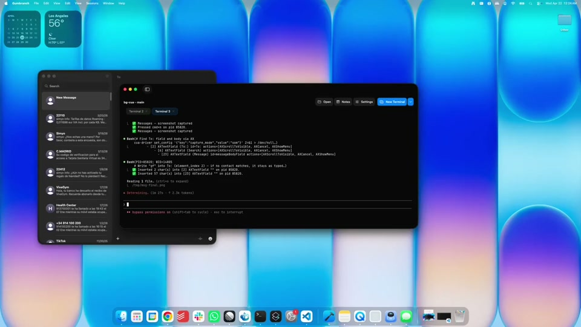](https://video.twimg.com/amplify_video/2047380131094937600/vid/avc1/1280x720/oXE3OhokShcozWmS.mp4)

- Media 1: [highest-resolution MP4](https://video.twimg.com/amplify_video/2047380131094937600/vid/avc1/1280x720/oXE3OhokShcozWmS.mp4)
- Resolution: 1280×720 · Duration: 2:06 · Type: video
- [Original X poster](https://pbs.twimg.com/amplify_video_thumb/2047380131094937600/img/KlxipJZPQnPNt_AB.jpg)

### 2026-04-23 · reply · [Post 2047383209244287350](https://x.com/trycua/status/2047383209244287350)

> Pulling visual context out of apps I'm not looking at. Here's Claude Code playing a YouTube scene in a Chrome tab I never raised.  6/8 https://t.co/ZYQ9hcRSmU

- Media 1: [highest-resolution MP4](https://video.twimg.com/amplify_video/2047379829042065408/vid/avc1/1280x720/te2UgRiP_4gm8Giu.mp4)
- Resolution: 1280×720 · Duration: 0:13 · Type: video
- [Original X poster](https://pbs.twimg.com/amplify_video_thumb/2047379829042065408/img/CI-tPdl5xpLrT6du.jpg)

### 2026-04-23 · reply · [Post 2047383207612645426](https://x.com/trycua/status/2047383207612645426)

> Delegated demo capture. Agent drives the app, cua-driver record and renders zoom-on-click at export. Imagine just delegating an entire product demo to an agent, background computer-use now unlocks this.  5/8 https://t.co/PgHRDvl1fo

- Media 1: [highest-resolution MP4](https://video.twimg.com/amplify_video/2047379960906883072/vid/avc1/1280x720/_jOaJRNzaCA2SMXu.mp4)
- Resolution: 1280×720 · Duration: 0:19 · Type: video
- [Original X poster](https://pbs.twimg.com/amplify_video_thumb/2047379960906883072/img/4KwmUtfWSNjo9ovO.jpg)

### 2026-04-23 · reply · [Post 2047383205444251889](https://x.com/trycua/status/2047383205444251889)

> Background dev loop. Claude Code reproes a visual bug, writes the fix, QAs it. My agent harness stayed frontmost the whole time.  4/8 https://t.co/GUWu6ok7Rs

- Media 1: [highest-resolution MP4](https://video.twimg.com/amplify_video/2047379490725416960/vid/avc1/1280x720/Jad8fBv6lY_gC56V.mp4)
- Resolution: 1280×720 · Duration: 1:45 · Type: video
- [Original X poster](https://pbs.twimg.com/amplify_video_thumb/2047379490725416960/img/K0ftlTmk4hTPJ2eU.jpg)

### 2026-01-22 · [Post 2014406820887183512](https://x.com/trycua/status/2014406820887183512)

> We've been using Cua-Bench internally—and with customers—for the last few months to evaluate every computer-use agent we deploy.   Today it's open-source. 15 public tasks, 40 variations, adapters for OSWorld and Windows Agent Arena. One CLI, self-hostable. https://t.co/uKE6DziDgd

- Media 1: [highest-resolution MP4](https://video.twimg.com/amplify_video/2014406126427860992/vid/avc1/1920x1080/dD5JFwLEV78gjTOP.mp4)
- Resolution: 1920×1080 · Duration: 0:50 · Type: video
- [Original X poster](https://pbs.twimg.com/amplify_video_thumb/2014406126427860992/img/o-hjnOvA33QX2Sqm.jpg)

### 2025-12-16 · [Post 2000972986090709370](https://x.com/trycua/status/2000972986090709370)

> Today we're announcing cua-bench: a framework for benchmarking, training data, and RL environments for computer-use AI agents. Why? Current agents show 10x variance across minor UI changes. Here's how we're fixing it. https://t.co/nD0JTFHWjJ

[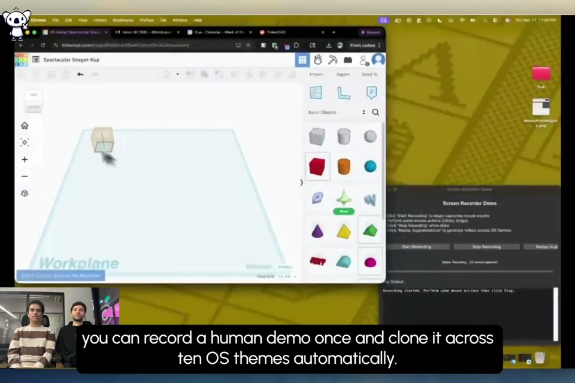](https://video.twimg.com/amplify_video/2000972576449769489/vid/avc1/1620x1080/xhYZQmia6JTgIYhL.mp4)

- Media 1: [highest-resolution MP4](https://video.twimg.com/amplify_video/2000972576449769489/vid/avc1/1620x1080/xhYZQmia6JTgIYhL.mp4)
- Resolution: 1620×1080 · Duration: 2:03 · Type: video
- [Original X poster](https://pbs.twimg.com/amplify_video_thumb/2000972576449769489/img/94WIrv1XYN7lgL6Z.jpg)

### 2025-11-25 · [Post 1993108531810111906](https://x.com/trycua/status/1993108531810111906)

> 1/3 We've just added Claude Opus 4.5 support to the Cua VLM Router and Playground - and you can already see it running inside Windows sandboxes. Early results are seriously impressive, even on tricky desktop workflows. https://t.co/bxRVOPeVw3

[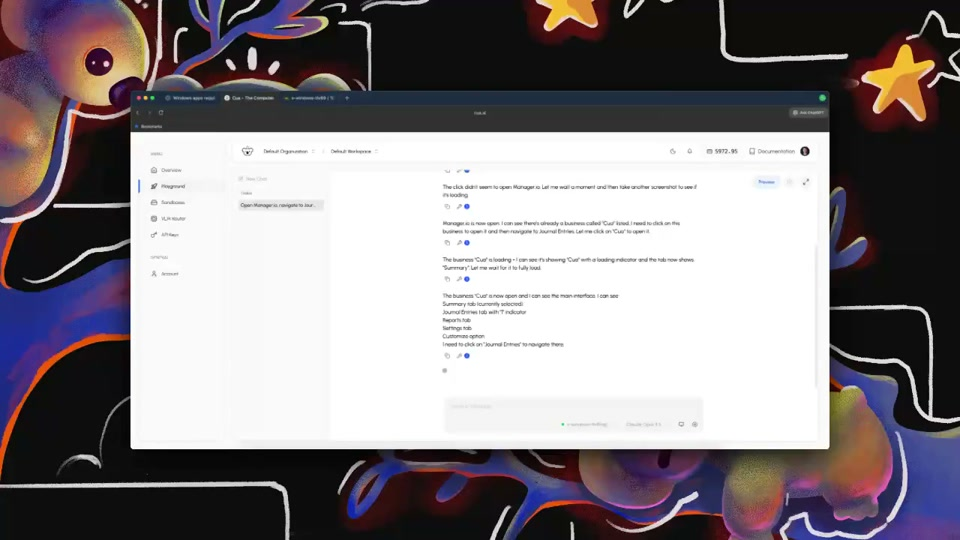](https://video.twimg.com/amplify_video/1993106941917204480/vid/avc1/1280x720/w9YNFQ0c2fnbJoep.mp4)

- Media 1: [highest-resolution MP4](https://video.twimg.com/amplify_video/1993106941917204480/vid/avc1/1280x720/w9YNFQ0c2fnbJoep.mp4)
- Resolution: 1280×720 · Duration: 1:42 · Type: video
- [Original X poster](https://pbs.twimg.com/amplify_video_thumb/1993106941917204480/img/I8taKLccVjm1nFsr.jpg)

### 2025-11-20 · reply · [Post 1991598760020045950](https://x.com/trycua/status/1991598760020045950)

> 2/4 Deploy a sandbox, connect to Playground, and start sending prompts. Watch your agent interact with the desktop in real-time with full tool call visualization.  Multi-model support: Claude Sonnet 4.5 and Haiku 4.5 https://t.co/pDSurhsPnJ

- Media 1: [highest-resolution MP4](https://video.twimg.com/amplify_video/1991596003212787712/vid/avc1/1068x720/A5gkbVkgn5XkXWm5.mp4)
- Resolution: 1068×720 · Duration: 0:38 · Type: video
- [Original X poster](https://pbs.twimg.com/amplify_video_thumb/1991596003212787712/img/vDFjidde-cWubqvP.jpg)

### 2025-11-17 · reply · [Post 1990468975952531620](https://x.com/trycua/status/1990468975952531620)

> 2/4 Cloud Windows 11 sandboxes hot-start in under a second and persist everything between sessions. No more local Windows Sandbox resets or complex VM setups depending on Windows Sandbox or KVM.  3 sizes available: • Small: 2 cores, 8GB RAM (8 credits/hour) • Medium: 4 cores, https://t.co/SBzZz9RwHN

[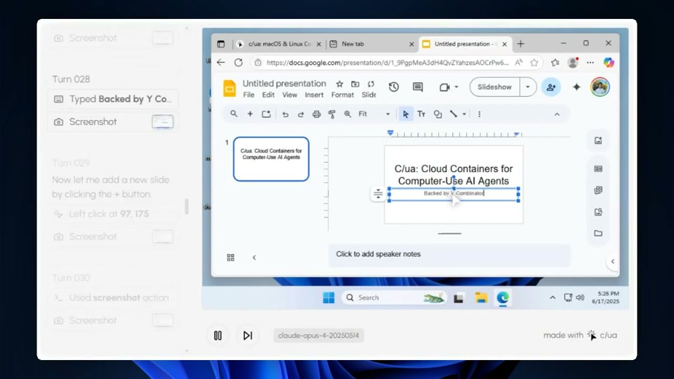](https://video.twimg.com/amplify_video/1990466059187412992/vid/avc1/1280x720/msroKtAmFp246AwX.mp4)

- Media 1: [highest-resolution MP4](https://video.twimg.com/amplify_video/1990466059187412992/vid/avc1/1280x720/msroKtAmFp246AwX.mp4)
- Resolution: 1280×720 · Duration: 1:10 · Type: video
- [Original X poster](https://pbs.twimg.com/amplify_video_thumb/1990466059187412992/img/Bd1ey9UYtl8mPx8O.jpg)

### 2025-10-15 · reply · [Post 1978577658750685677](https://x.com/trycua/status/1978577658750685677)

> Here's Sonnet 4.5 completing the same task - 3 minutes vs 2 minutes.  The real insight: Haiku 4.5 (50.7% OSWorld) vs Sonnet 4.5 (61.4%) isn't just a small model - it's last quarter's frontier model at 1/3 the cost.  Benchmark full OSWorld for $200. Previously this cost $600 per https://t.co/CS9qGEYq8F

[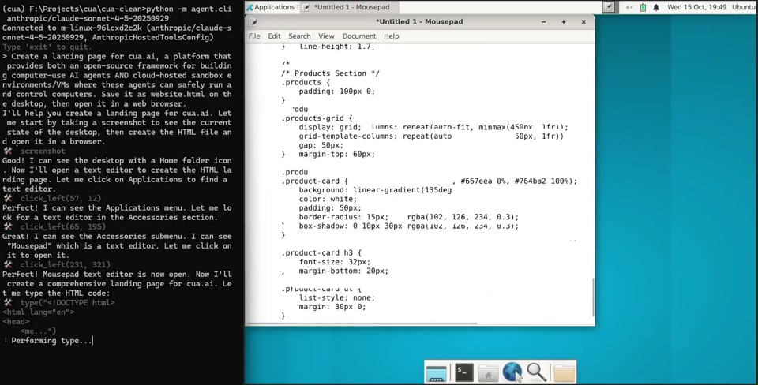](https://video.twimg.com/amplify_video/1978577254411313152/vid/avc1/1518x772/RVOS-grDRuMtmm-v.mp4)

- Media 1: [highest-resolution MP4](https://video.twimg.com/amplify_video/1978577254411313152/vid/avc1/1518x772/RVOS-grDRuMtmm-v.mp4)
- Resolution: 1518×772 · Duration: 3:03 · Type: video
- [Original X poster](https://pbs.twimg.com/amplify_video_thumb/1978577254411313152/img/nXgZjHaWvfGDn2JP.jpg)

### 2025-10-15 · [Post 1978577656443498562](https://x.com/trycua/status/1978577656443498562)

> We tried Claude Haiku 4.5 on a computer-use task and it's faster + 3.5x cheaper than Sonnet 4.5:  "Create a landing page of Cua and open it in browser"  - Haiku 4.5: 2 minutes, $0.04 - Sonnet 4.5: 3 minutes, ~$0.14  This changes the economics of agentic automation ↴  1/2 https://t.co/nzvQIQ1JT7

[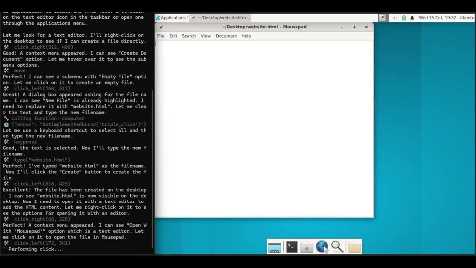](https://video.twimg.com/amplify_video/1978572832742539264/vid/avc1/1280x720/vS2hwpgjbJQ56Ee1.mp4)

- Media 1: [highest-resolution MP4](https://video.twimg.com/amplify_video/1978572832742539264/vid/avc1/1280x720/vS2hwpgjbJQ56Ee1.mp4)
- Resolution: 1280×720 · Duration: 2:07 · Type: video
- [Original X poster](https://pbs.twimg.com/amplify_video_thumb/1978572832742539264/img/-zYh4RzCr2hnNQv9.jpg)

### 2025-10-08 · [Post 1976001242901119401](https://x.com/trycua/status/1976001242901119401)

> Cua ❤️ open-weight models  Highly requested by the Discord community, we tested Moondream3 and Salesforce GTA-1 for UI grounding in computer-use agents  1/3 https://t.co/QwpMpTqo9d

[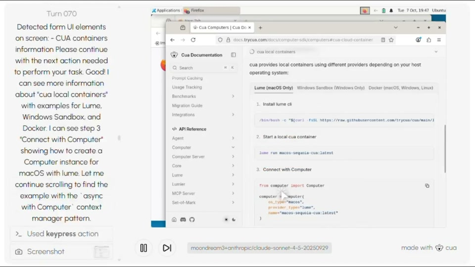](https://video.twimg.com/amplify_video/1975995688392773632/vid/avc1/1280x720/RuSzH8BH8ihe424c.mp4)

- Media 1: [highest-resolution MP4](https://video.twimg.com/amplify_video/1975995688392773632/vid/avc1/1280x720/RuSzH8BH8ihe424c.mp4)
- Resolution: 1280×720 · Duration: 1:20 · Type: video
- [Original X poster](https://pbs.twimg.com/amplify_video_thumb/1975995688392773632/img/JcZl9MknNZbSecwm.jpg)

### 2025-10-02 · [Post 1973799068263723050](https://x.com/trycua/status/1973799068263723050)

> We ran one of our hardest computer-use benchmarks on Anthropic Sonnet 4.5, side-by-side with Sonnet 4 ↴↴  1/4 https://t.co/zQ3pOkgd27

[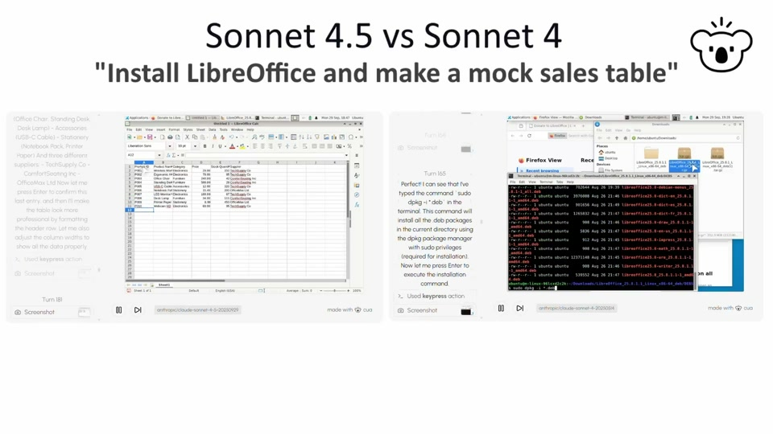](https://video.twimg.com/amplify_video/1973796522950340610/vid/avc1/1920x1080/P_RHSoFTLwqIjZ85.mp4)

- Media 1: [highest-resolution MP4](https://video.twimg.com/amplify_video/1973796522950340610/vid/avc1/1920x1080/P_RHSoFTLwqIjZ85.mp4)
- Resolution: 1920×1080 · Duration: 0:52 · Type: video
- [Original X poster](https://pbs.twimg.com/amplify_video_thumb/1973796522950340610/img/EpaPpS9J1KgKuM9h.jpg)

### 2025-08-29 · [Post 1961443982350635182](https://x.com/trycua/status/1961443982350635182)

> Day 5 of 5 Days of Cua: Introducing Human-in-the-Loop. Sometimes the best agent is you. Instant handoff from AI to human control when tasks need further judgment.  1/5 https://t.co/0qh6cphi9s

[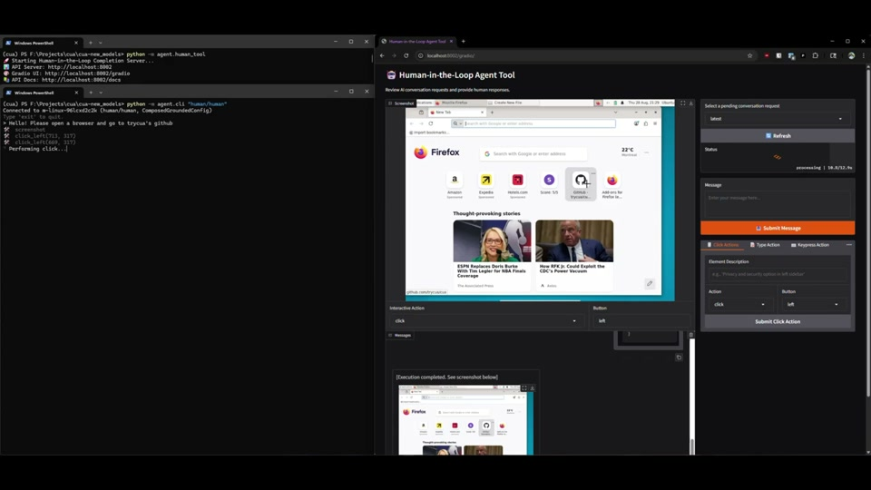](https://video.twimg.com/amplify_video/1961442355241730048/vid/avc1/1280x720/hj4HpsPUWkogEiJE.mp4)

- Media 1: [highest-resolution MP4](https://video.twimg.com/amplify_video/1961442355241730048/vid/avc1/1280x720/hj4HpsPUWkogEiJE.mp4)
- Resolution: 1280×720 · Duration: 0:32 · Type: video
- [Original X poster](https://pbs.twimg.com/amplify_video_thumb/1961442355241730048/img/RNNB0cLKYtaucnC_.jpg)

### 2025-08-13 · [Post 1955629742394106043](https://x.com/trycua/status/1955629742394106043)

> New mask. Same task. Cua is rebranding: from🖱️ pointer to 🐨 Cua-la, our new mascot.  1/3 https://t.co/dm8FNCiDRZ

- Media 1: [highest-resolution MP4](https://video.twimg.com/amplify_video/1955624007820091392/vid/avc1/1080x1080/9zixgGj3Oms3GcEp.mp4)
- Resolution: 1080×1080 · Duration: 0:05 · Type: video
- [Original X poster](https://pbs.twimg.com/amplify_video_thumb/1955624007820091392/img/PoccESXKH9_hynzl.jpg)

### 2025-08-12 · [Post 1955319138005512596](https://x.com/trycua/status/1955319138005512596)

> You can now use the open-source GLM-4.5V model with the Cua Agent framework.  1/6 https://t.co/GzO8sHgqG6

[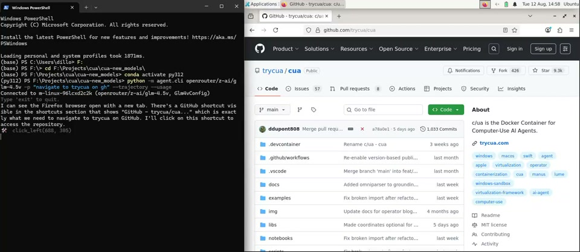](https://video.twimg.com/amplify_video/1955317977571635200/vid/avc1/1772x770/mkafwHpOb6E6NGZA.mp4)

- Media 1: [highest-resolution MP4](https://video.twimg.com/amplify_video/1955317977571635200/vid/avc1/1772x770/mkafwHpOb6E6NGZA.mp4)
- Resolution: 1772×770 · Duration: 0:35 · Type: video
- [Original X poster](https://pbs.twimg.com/amplify_video_thumb/1955317977571635200/img/RhWj9xZZzfIemnaV.jpg)

### 2025-08-07 · [Post 1953583236501631084](https://x.com/trycua/status/1953583236501631084)

> GPT-5 for Computer-Use agents. Same tasks, same grounding model - we just swapped GPT-4o → GPT-5 as the thinking model. Left = 4o, right = 5. Watch GPT-5 pull away.  1/2 https://t.co/eXl8tJ2R2B

[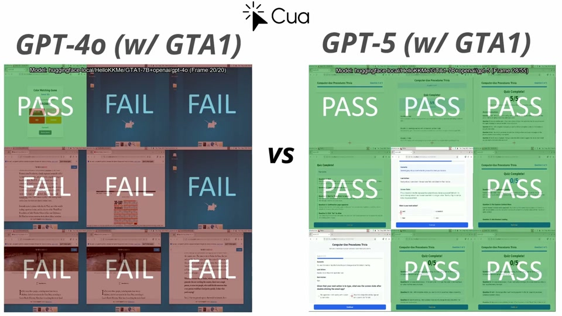](https://video.twimg.com/amplify_video/1953581638429835264/vid/avc1/1920x1080/5kJc1FsY1N4GnB44.mp4)

- Media 1: [highest-resolution MP4](https://video.twimg.com/amplify_video/1953581638429835264/vid/avc1/1920x1080/5kJc1FsY1N4GnB44.mp4)
- Resolution: 1920×1080 · Duration: 0:28 · Type: video
- [Original X poster](https://pbs.twimg.com/amplify_video_thumb/1953581638429835264/img/ifcipX0cy8zVlHD5.jpg)

### 2025-08-05 · [Post 1952774028726272477](https://x.com/trycua/status/1952774028726272477)

> Bringing Computer-Use to the Web - control cloud desktops from JavaScript/TypeScript, right in the browser.  1/6 https://t.co/V7vuTCZheL

[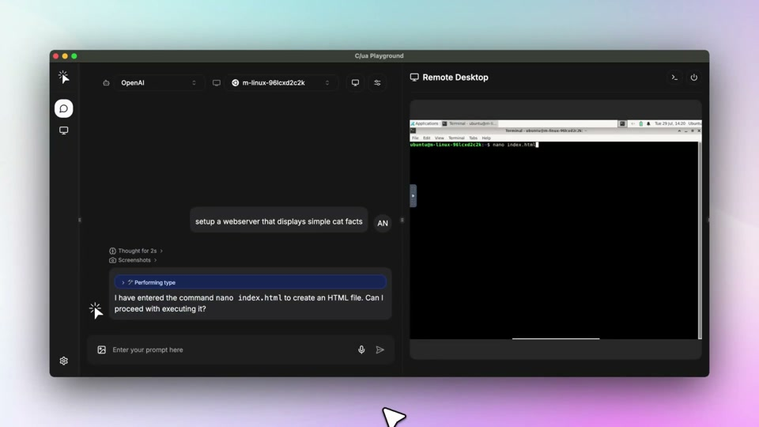](https://video.twimg.com/amplify_video/1952771537469095936/vid/avc1/1920x1080/6QnWQWzRgq2UyPs2.mp4)

- Media 1: [highest-resolution MP4](https://video.twimg.com/amplify_video/1952771537469095936/vid/avc1/1920x1080/6QnWQWzRgq2UyPs2.mp4)
- Resolution: 1920×1080 · Duration: 0:28 · Type: video
- [Original X poster](https://pbs.twimg.com/amplify_video_thumb/1952771537469095936/img/u62IcbBhPwge8MNy.jpg)

### 2025-06-01 · [Post 1929183135818002546](https://x.com/trycua/status/1929183135818002546)

> Introducing App-Use - create virtual desktops for AI agents to focus on specific apps.  1/6 https://t.co/ApHNu7yr5Y

[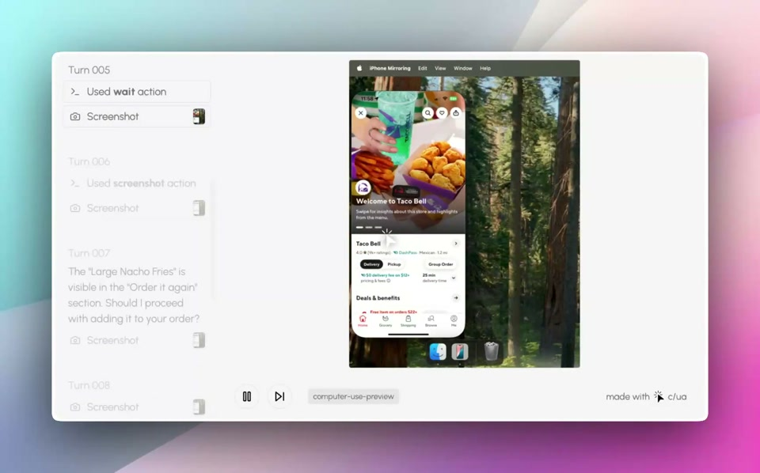](https://video.twimg.com/amplify_video/1929180889193517056/vid/avc1/1732x1080/HlYgBKAlaZNH91sh.mp4)

- Media 1: [highest-resolution MP4](https://video.twimg.com/amplify_video/1929180889193517056/vid/avc1/1732x1080/HlYgBKAlaZNH91sh.mp4)
- Resolution: 1732×1080 · Duration: 0:17 · Type: video
- [Original X poster](https://pbs.twimg.com/amplify_video_thumb/1929180889193517056/img/ub7I7Iv5_KEHyXCv.jpg)

### 2025-05-14 · [Post 1922738968703201408](https://x.com/trycua/status/1922738968703201408)

> c/ua ❤️ Docker. Introducing Lumier: run macOS VMs on Docker containers in minutes with minimal setup https://t.co/6V5FaZs7WT

- Media 1: [highest-resolution MP4](https://video.twimg.com/amplify_video/1922738196422721536/vid/avc1/2032x1080/8pWMPmUDqZnc4Y1S.mp4)
- Resolution: 2032×1080 · Duration: 0:24 · Type: video
- [Original X poster](https://pbs.twimg.com/amplify_video_thumb/1922738196422721536/img/eU0cPF6vGl09sdqo.jpg)

### 2025-05-08 · [Post 1920510506034507863](https://x.com/trycua/status/1920510506034507863)

> We vibe-photoshopped a cofounder using C/ua https://t.co/jQ7jv4XV50

[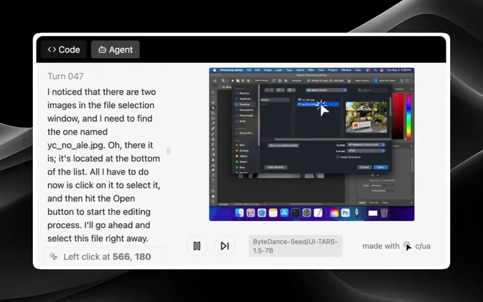](https://video.twimg.com/amplify_video/1920506128087011328/vid/avc1/1148x720/65Tu-_PsMKTqocFw.mp4)

- Media 1: [highest-resolution MP4](https://video.twimg.com/amplify_video/1920506128087011328/vid/avc1/1148x720/65Tu-_PsMKTqocFw.mp4)
- Resolution: 1148×720 · Duration: 1:33 · Type: video
- [Original X poster](https://pbs.twimg.com/amplify_video_thumb/1920506128087011328/img/lfEWlWrFa-k1AGxk.jpg)

### 2025-05-06 · [Post 1919849158132863035](https://x.com/trycua/status/1919849158132863035)

> The era of local Computer-Use AI Agents is here. https://t.co/85TavU9ORR

[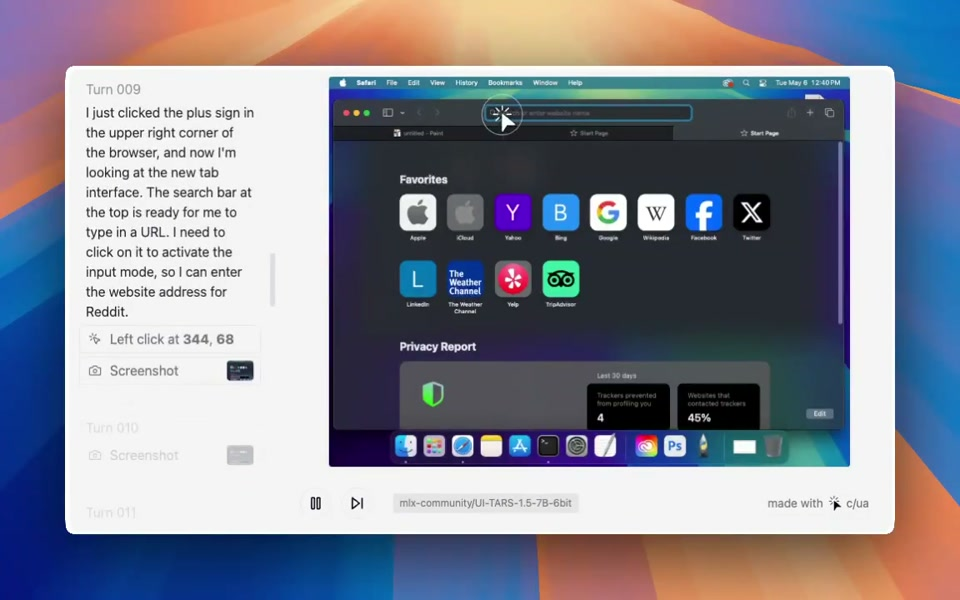](https://video.twimg.com/amplify_video/1919845621663727622/vid/avc1/1152x720/8zaOtoBmDKQTf7Ot.mp4?tag=16)

- Media 1: [highest-resolution MP4](https://video.twimg.com/amplify_video/1919845621663727622/vid/avc1/1152x720/8zaOtoBmDKQTf7Ot.mp4?tag=16)
- Resolution: 1152×720 · Duration: 0:21 · Type: video
- [Original X poster](https://pbs.twimg.com/amplify_video_thumb/1919845621663727622/img/qbaeC2khHLRLH7VV.jpg)

### 2025-05-02 · [Post 1918186221790216454](https://x.com/trycua/status/1918186221790216454)

> C/ua now supports agent trajectory replay. Here's a behind-the-scenes look at it in action, thanks to one of our awesome users. https://t.co/40THdpnxic

- Media 1: [highest-resolution MP4](https://video.twimg.com/amplify_video/1918179600540286978/vid/avc1/1728x1080/Jn2jHPS1ItUr4Pu3.mp4?tag=16)
- Resolution: 1728×1080 · Duration: 0:39 · Type: video
- [Original X poster](https://pbs.twimg.com/amplify_video_thumb/1918179600540286978/img/3ktDuI-T_gNGDqiZ.jpg)

### 2025-04-10 · [Post 1910455692861071414](https://x.com/trycua/status/1910455692861071414)

> Cua loves MCP. Launching official MCP Server support today - enabling our Computer-Use Agent to run through Claude Desktop, Cursor, and other MCP clients. https://t.co/ct4o5zHYri

[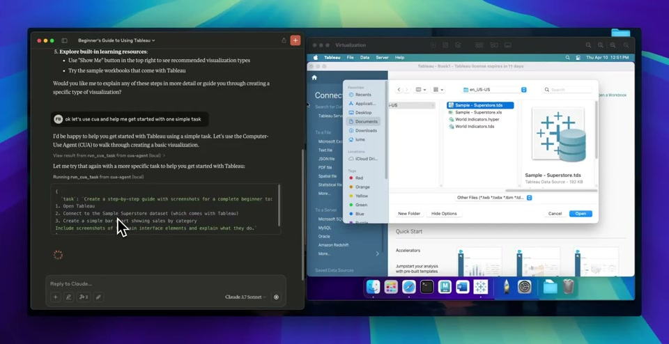](https://video.twimg.com/amplify_video/1910455038218297344/vid/avc1/1402x720/mKQBqJT2MrOSgcHi.mp4?tag=14)

- Media 1: [highest-resolution MP4](https://video.twimg.com/amplify_video/1910455038218297344/vid/avc1/1402x720/mKQBqJT2MrOSgcHi.mp4?tag=14)
- Resolution: 1402×720 · Duration: 1:55 · Type: video
- [Original X poster](https://pbs.twimg.com/amplify_video_thumb/1910455038218297344/img/Y9yzDyKXDEYGWyk1.jpg)

### 2025-03-21 · [Post 1903156438119354380](https://x.com/trycua/status/1903156438119354380)

> Shoutout to our amazing contributor @iaktech for building tlume - a CLI tool that converts Tart VM images into the format expected by Lume! https://t.co/Igjkxv0szo

[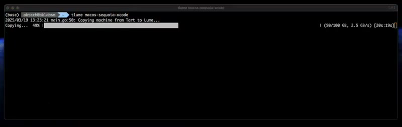](https://video.twimg.com/tweet_video/GmlZFrjbwAAwLJ_.mp4)

- Media 1: [highest-resolution MP4](https://video.twimg.com/tweet_video/GmlZFrjbwAAwLJ_.mp4)
- Resolution: 800×254 · Duration: 0:11 · Type: animated_gif
- [Original X poster](https://pbs.twimg.com/tweet_video_thumb/GmlZFrjbwAAwLJ_.jpg)

### 2025-03-12 · [Post 1899801794324087214](https://x.com/trycua/status/1899801794324087214)

> We've just started sending invites for the internal preview of Computer and Agent. If you're an early tester, check your inbox! We’d love your feedback. https://t.co/snGWI3o582

- Media 1: [highest-resolution MP4](https://video.twimg.com/ext_tw_video/1899799120958599168/pu/vid/avc1/1280x720/bg1I4iuC6gAISDlq.mp4?tag=12)
- Resolution: 1280×720 · Duration: 1:35 · Type: video
- [Original X poster](https://pbs.twimg.com/ext_tw_video_thumb/1899799120958599168/pu/img/Ir3_KYujFHeSv7MZ.jpg)

### 2025-02-22 · [Post 1893326162685796431](https://x.com/trycua/status/1893326162685796431)

> CUA Agent of Agents – In 2025, CUA agents will infuse AI into your apps and copilots. Example? A CUA agent using Browser + Cursor to set you on the right track to solving a GitHub issue https://t.co/Rf779tOYVJ

[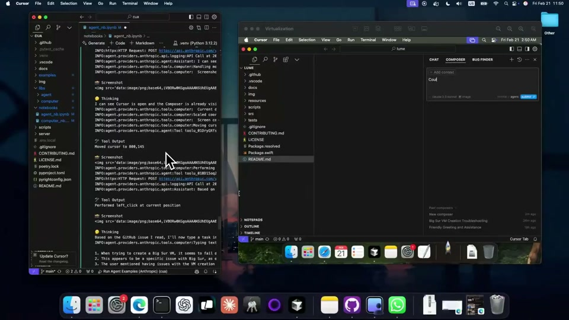](https://video.twimg.com/ext_tw_video/1893319222350020608/pu/vid/avc1/1280x720/5IOLWv47cm6wgLRC.mp4?tag=12)

- Media 1: [highest-resolution MP4](https://video.twimg.com/ext_tw_video/1893319222350020608/pu/vid/avc1/1280x720/5IOLWv47cm6wgLRC.mp4?tag=12)
- Resolution: 1280×720 · Duration: 1:35 · Type: video
- [Original X poster](https://pbs.twimg.com/ext_tw_video_thumb/1893319222350020608/pu/img/XjqunS0KmpiNzOUa.jpg)

### 2025-02-03 · [Post 1886421619242897752](https://x.com/trycua/status/1886421619242897752)

> Our CLI just hit 1K stars in under 24 hours and even trended on @hackernews! Huge thanks to everyone who supported us in our first release. Stay tuned as we reveal more about our mission and what we've been cooking up over the past few months. Drop by the comments for a hint! https://t.co/H2uIe9MMs7

- Media 1: [highest-resolution MP4](https://video.twimg.com/ext_tw_video/1886421423058534400/pu/vid/avc1/1280x720/ekFjr-dGBU8kFPA2.mp4?tag=12)
- Resolution: 1280×720 · Duration: 0:04 · Type: video
- [Original X poster](https://pbs.twimg.com/ext_tw_video_thumb/1886421423058534400/pu/img/EGsHIZhecQKcTaOa.jpg)

## @francedot

[Public media timeline used for discovery](https://nitter.kareem.one/francedot/media)

### 2026-06-17 · reply · [Post 2067338995315663050](https://x.com/francedot/status/2067338995315663050)

> @eve_bouff @eveporcello https://t.co/OvzbtFvQB6

- Media 1: [highest-resolution MP4](https://video.twimg.com/tweet_video/HLCp26UaYAAPBkq.mp4)
- Resolution: 480×270 · Duration: 0:01 · Type: animated_gif
- [Original X poster](https://pbs.twimg.com/tweet_video_thumb/HLCp26UaYAAPBkq.jpg)

### 2026-06-13 · reply · [Post 2065616452250738866](https://x.com/francedot/status/2065616452250738866)

> @milindlabs back to https://t.co/XlF73q4l9w

- Media 1: [highest-resolution MP4](https://video.twimg.com/tweet_video/HKqLNb_bgAAa6gG.mp4)
- Resolution: 436×246 · Duration: 0:05 · Type: animated_gif
- [Original X poster](https://pbs.twimg.com/tweet_video_thumb/HKqLNb_bgAAa6gG.jpg)

### 2026-06-03 · [Post 2062231318294131130](https://x.com/francedot/status/2062231318294131130)

> at #MSBuild this year agents learned how to click and play a piano - here's @TheChainsmokers @msdev on Windows! powered by @trycua Cua Driver https://t.co/qSXWYPECfT

[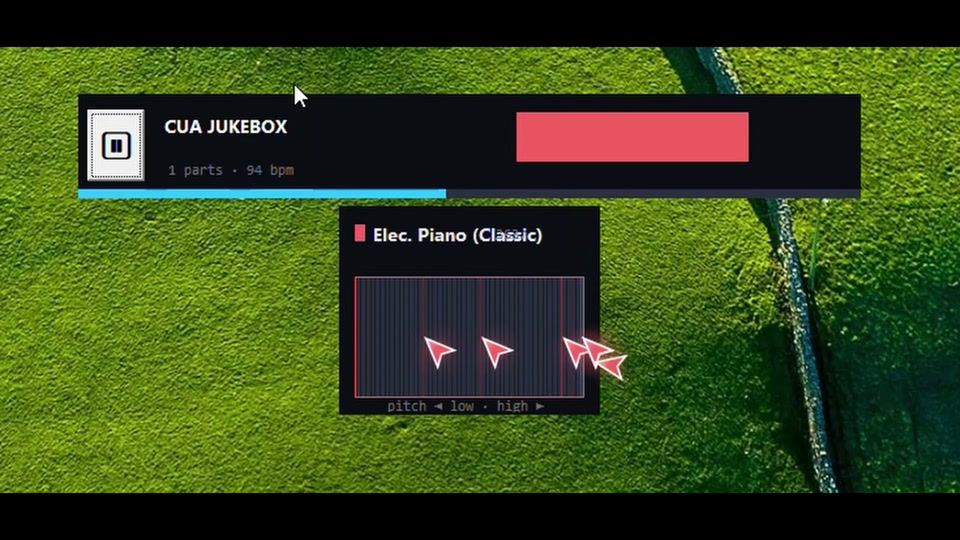](https://video.twimg.com/amplify_video/2062231125347778560/vid/avc1/1920x1080/UuLfTw3Fooc_kUcC.mp4)

- Media 1: [highest-resolution MP4](https://video.twimg.com/amplify_video/2062231125347778560/vid/avc1/1920x1080/UuLfTw3Fooc_kUcC.mp4)
- Resolution: 1920×1080 · Duration: 0:45 · Type: video
- [Original X poster](https://pbs.twimg.com/amplify_video_thumb/2062231125347778560/img/vw_EYQR-x0H6bfYC.jpg)

### 2026-06-02 · [Post 2061831102185214269](https://x.com/francedot/status/2061831102185214269)

> we handed an agent Cua Driver and a keyboard, and it played “Don’t Stop Me Now.”  happy #MSBuild ! https://t.co/xIQZcW18qG

[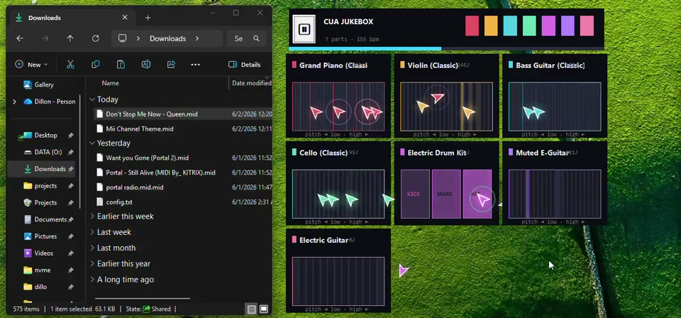](https://video.twimg.com/amplify_video/2061830805203382272/vid/avc1/1296x604/D2Tlirmj5mpir6Ei.mp4)

- Media 1: [highest-resolution MP4](https://video.twimg.com/amplify_video/2061830805203382272/vid/avc1/1296x604/D2Tlirmj5mpir6Ei.mp4)
- Resolution: 1296×604 · Duration: 3:37 · Type: video
- [Original X poster](https://pbs.twimg.com/amplify_video_thumb/2061830805203382272/img/Z_PqeYADw8Z3jyqY.jpg)

### 2026-06-02 · [Post 2061813117265522830](https://x.com/francedot/status/2061813117265522830)

> had to be done 🪄 https://t.co/zJPNK8oDqK

- Media 1: [highest-resolution MP4](https://video.twimg.com/amplify_video/2061813052966936576/vid/avc1/1206x2622/aFL9h-KTlIp_uvnM.mp4)
- Resolution: 1206×2622 · Duration: 0:11 · Type: video
- [Original X poster](https://pbs.twimg.com/amplify_video_thumb/2061813052966936576/img/kavCLmtzMFYUHLkc.jpg)

### 2026-06-02 · reply · [Post 2061706672377397735](https://x.com/francedot/status/2061706672377397735)

> 3/ What makes it work: each agent opens a named session tied to one window, and its cursor only touches that window, so they don't collide. Inputs run through both accessibility tree and vision, and an agent clicks and types in a background window without raising it. https://t.co/VO4B1J729l

[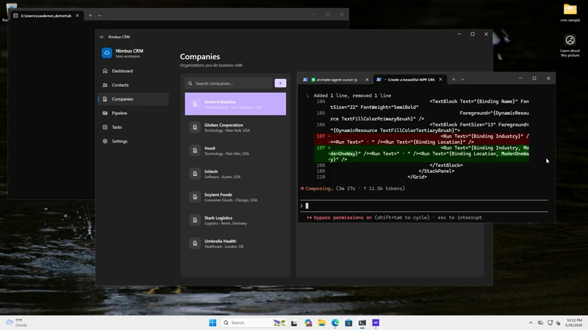](https://video.twimg.com/amplify_video/2061688856819486720/vid/avc1/1280x720/5h7FoVAL8BbSrnu1.mp4)

- Media 1: [highest-resolution MP4](https://video.twimg.com/amplify_video/2061688856819486720/vid/avc1/1280x720/5h7FoVAL8BbSrnu1.mp4)
- Resolution: 1280×720 · Duration: 2:37 · Type: video
- [Original X poster](https://pbs.twimg.com/amplify_video_thumb/2061688856819486720/img/23SuSV78D7rz9YAQ.jpg)

### 2026-06-02 · reply · [Post 2061706670208897279](https://x.com/francedot/status/2061706670208897279)

> 2/ To celebrate #MSBuild tomorrow, here it is running on Windows: @NousResearch's Hermes subagents drive 4 windows of the same app at once, each cursor its own color, none touching your keyboard or moving the real mouse. https://t.co/kUQz5ocqQj

- Media 1: [highest-resolution MP4](https://video.twimg.com/amplify_video/2061704846185840640/vid/avc1/1920x1080/L25lMMtkcmiVukk_.mp4)
- Resolution: 1920×1080 · Duration: 0:22 · Type: video
- [Original X poster](https://pbs.twimg.com/amplify_video_thumb/2061704846185840640/img/YoY2UCFNuWLpHQQW.jpg)

### 2026-06-02 · [Post 2061706667281269221](https://x.com/francedot/status/2061706667281269221)

> 1/ This week our team at @trycua worked hard to ship cua-driver v0.5. The headline is a new primitive, Agent Cursors: many background agents can now each own a cursor, scoped to a non-overlapping action space. https://t.co/vAjRWd4t5e

- Media 1: [highest-resolution MP4](https://video.twimg.com/tweet_video/HJycjmVbAAAab34.mp4)
- Resolution: 720×404 · Duration: 0:09 · Type: animated_gif
- [Original X poster](https://pbs.twimg.com/tweet_video_thumb/HJycjmVbAAAab34.jpg)

### 2026-06-01 · reply · [Post 2061279320731980267](https://x.com/francedot/status/2061279320731980267)

> @pierceboggan https://t.co/1uPwXY6yaO

- Media 1: [highest-resolution MP4](https://video.twimg.com/tweet_video/HJsinPtWwAUNDcM.mp4)
- Resolution: 220×166 · Duration: 0:06 · Type: animated_gif
- [Original X poster](https://pbs.twimg.com/tweet_video_thumb/HJsinPtWwAUNDcM.jpg)

### 2026-05-12 · reply · [Post 2053993008412946705](https://x.com/francedot/status/2053993008412946705)

> @DavidPrenticeJr @Teknium @NousResearch @trycua https://t.co/XUzi08piwv

- Media 1: [highest-resolution MP4](https://video.twimg.com/tweet_video/HIE_wIAWoAA9llw.mp4)
- Resolution: 498×368 · Duration: 0:02 · Type: animated_gif
- [Original X poster](https://pbs.twimg.com/tweet_video_thumb/HIE_wIAWoAA9llw.jpg)

### 2026-05-11 · reply · [Post 2053980209934639214](https://x.com/francedot/status/2053980209934639214)

> @tonysimons_ @NousResearch https://t.co/2xedTTQIYG

- Media 1: [highest-resolution MP4](https://video.twimg.com/tweet_video/HIE0HXxXkAA_o_y.mp4)
- Resolution: 220×158 · Duration: 0:05 · Type: animated_gif
- [Original X poster](https://pbs.twimg.com/tweet_video_thumb/HIE0HXxXkAA_o_y.jpg)

### 2026-05-06 · reply · [Post 2052041969283821986](https://x.com/francedot/status/2052041969283821986)

> @4xiom_ @FarzaTV https://t.co/8Gh9dcP9kZ

- Media 1: [highest-resolution MP4](https://video.twimg.com/tweet_video/HHpRSyIaQAANr-l.mp4)
- Resolution: 220×124 · Duration: 0:05 · Type: animated_gif
- [Original X poster](https://pbs.twimg.com/tweet_video_thumb/HHpRSyIaQAANr-l.jpg)

### 2026-04-17 · [Post 2045176038939082781](https://x.com/francedot/status/2045176038939082781)

> alright alright.. enough silence on X. we’ll be dropping something cool next https://t.co/AI76di4Qe4

- Media 1: [highest-resolution MP4](https://video.twimg.com/tweet_video/HGHsxDbawAEqbGR.mp4)
- Resolution: 164×164 · Duration: 0:04 · Type: animated_gif
- [Original X poster](https://pbs.twimg.com/tweet_video_thumb/HGHsxDbawAEqbGR.jpg)

### 2026-02-16 · reply · [Post 2023431779756163406](https://x.com/francedot/status/2023431779756163406)

> @beffjezos @steipete @aplusk @gdb https://t.co/3zkc99z0FB

- Media 1: [highest-resolution MP4](https://video.twimg.com/tweet_video/HBSseYDWMAEsSBH.mp4)
- Resolution: 498×278 · Duration: 0:02 · Type: animated_gif
- [Original X poster](https://pbs.twimg.com/tweet_video_thumb/HBSseYDWMAEsSBH.jpg)

### 2026-02-01 · reply · [Post 2017792208871821495](https://x.com/francedot/status/2017792208871821495)

> @ewveggies https://t.co/DbBr9QaZJ7

- Media 1: [highest-resolution MP4](https://video.twimg.com/tweet_video/HACjUXAaMAEEXtm.mp4)
- Resolution: 244×150 · Duration: 0:03 · Type: animated_gif
- [Original X poster](https://pbs.twimg.com/tweet_video_thumb/HACjUXAaMAEEXtm.jpg)

### 2026-01-26 · reply · [Post 2015579774371135818](https://x.com/francedot/status/2015579774371135818)

> @iruletheworldmo @MatthewBerman https://t.co/eu04qoB1kY

- Media 1: [highest-resolution MP4](https://video.twimg.com/tweet_video/G_jHHtwbkAENy1o.mp4)
- Resolution: 164×164 · Duration: 0:04 · Type: animated_gif
- [Original X poster](https://pbs.twimg.com/tweet_video_thumb/G_jHHtwbkAENy1o.jpg)

### 2026-01-21 · reply · [Post 2014075819950473494](https://x.com/francedot/status/2014075819950473494)

> @gregpr07 @trycua https://t.co/G9lVCZDfO3

- Media 1: [highest-resolution MP4](https://video.twimg.com/tweet_video/G_NvSBVXwAAQRgz.mp4)
- Resolution: 498×278 · Duration: 0:02 · Type: animated_gif
- [Original X poster](https://pbs.twimg.com/tweet_video_thumb/G_NvSBVXwAAQRgz.jpg)

### 2025-12-11 · reply · [Post 1999227032526553330](https://x.com/francedot/status/1999227032526553330)

> @ajhodls @simontheweb https://t.co/wBsVW7dPBo

- Media 1: [highest-resolution MP4](https://video.twimg.com/tweet_video/G76uY3wa8AAJLzv.mp4)
- Resolution: 540×540 · Duration: 0:02 · Type: animated_gif
- [Original X poster](https://pbs.twimg.com/tweet_video_thumb/G76uY3wa8AAJLzv.jpg)

### 2025-10-08 · [Post 1975731213760663563](https://x.com/francedot/status/1975731213760663563)

> Cool update. But Gemini 2.5 Computer Use doesn't seem to have real computer tool calls @OfficialLoganK. Forcing computer calls will result in invalid browser-only code - tried with @trycua https://t.co/atLi2CzHJW

[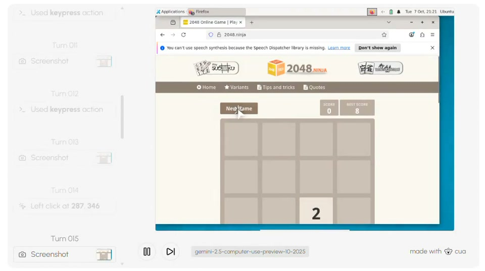](https://video.twimg.com/amplify_video/1975730456848179200/vid/avc1/1020x572/D5tbxsH8RP0wTSfs.mp4)

- Media 1: [highest-resolution MP4](https://video.twimg.com/amplify_video/1975730456848179200/vid/avc1/1020x572/D5tbxsH8RP0wTSfs.mp4)
- Resolution: 1020×572 · Duration: 0:34 · Type: video
- [Original X poster](https://pbs.twimg.com/amplify_video_thumb/1975730456848179200/img/Zam4tM8W0iNDx-Fh.jpg)

### 2025-10-01 · [Post 1973269686747013429](https://x.com/francedot/status/1973269686747013429)

> imagine being in the current YC batch and still having cash left after your launch demo video https://t.co/mp6thCJszm

[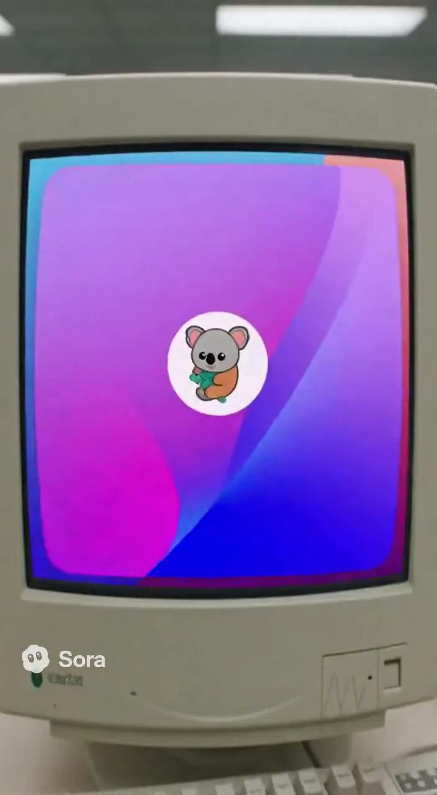](https://video.twimg.com/amplify_video/1973269612658827264/vid/avc1/704x1280/bW8YzxvwRDa3bZB6.mp4)

- Media 1: [highest-resolution MP4](https://video.twimg.com/amplify_video/1973269612658827264/vid/avc1/704x1280/bW8YzxvwRDa3bZB6.mp4)
- Resolution: 704×1280 · Duration: 0:10 · Type: video
- [Original X poster](https://pbs.twimg.com/amplify_video_thumb/1973269612658827264/img/BPA1UhjuMm_19WGS.jpg)

### 2025-10-01 · [Post 1973267552815210638](https://x.com/francedot/status/1973267552815210638)

> you heard Sam https://t.co/bcBiQApiZ2

- Media 1: [highest-resolution MP4](https://video.twimg.com/amplify_video/1973267476902522880/vid/avc1/704x1280/5rc57YTxex7Dn9hf.mp4)
- Resolution: 704×1280 · Duration: 0:09 · Type: video
- [Original X poster](https://pbs.twimg.com/amplify_video_thumb/1973267476902522880/img/CvnWNbN4TBMR2EIb.jpg)

### 2025-09-13 · [Post 1967002179845452241](https://x.com/francedot/status/1967002179845452241)

> Packed room at Hack the North - 40+ students locked in on our CUA track - still building, asking questions, and helping each other at 2:30 am https://t.co/3NMY748I6i

- Media 1: [highest-resolution MP4](https://video.twimg.com/amplify_video/1967002122542596096/vid/avc1/1080x1920/q6KYZdISLlOcqTrh.mp4)
- Resolution: 1080×1920 · Duration: 0:07 · Type: video
- [Original X poster](https://pbs.twimg.com/amplify_video_thumb/1967002122542596096/img/jrHWDp6j1uCrd4qy.jpg)

### 2025-06-20 · [Post 1935881133377699903](https://x.com/francedot/status/1935881133377699903)

> X25, that’s a wrap! Grateful to YC for gathering such an incredible crew of likeminded builders https://t.co/siYQ21u5ri

- Media 1: [highest-resolution MP4](https://video.twimg.com/amplify_video/1935881072241262593/vid/avc1/720x960/ht2SUm4eyc5WaT3u.mp4)
- Resolution: 720×960 · Duration: 0:12 · Type: video
- [Original X poster](https://pbs.twimg.com/amplify_video_thumb/1935881072241262593/img/kuHiVAKHgjJispAW.jpg)

### 2025-05-29 · reply · [Post 1928185656972325316](https://x.com/francedot/status/1928185656972325316)

> @erikqu_ @trycua our night figuring out DNS issues with Cloudflare https://t.co/4tZUoDlRoL

- Media 1: [highest-resolution MP4](https://video.twimg.com/tweet_video/GsJKofMaUAIAONB.mp4)
- Resolution: 498×224 · Duration: 0:03 · Type: animated_gif
- [Original X poster](https://pbs.twimg.com/tweet_video_thumb/GsJKofMaUAIAONB.jpg)

### 2025-05-24 · reply · [Post 1926132196571586963](https://x.com/francedot/status/1926132196571586963)

> @garrytan @t_blom @koomen https://t.co/yBa7g9N101

- Media 1: [highest-resolution MP4](https://video.twimg.com/tweet_video/Grr_BZxWIAAXeN4.mp4)
- Resolution: 480×270 · Duration: 0:03 · Type: animated_gif
- [Original X poster](https://pbs.twimg.com/tweet_video_thumb/Grr_BZxWIAAXeN4.jpg)

### 2025-04-29 · [Post 1917059529298350569](https://x.com/francedot/status/1917059529298350569)

> what’s stopping you from working until dawn like this? https://t.co/tB2wiK5Dq2

[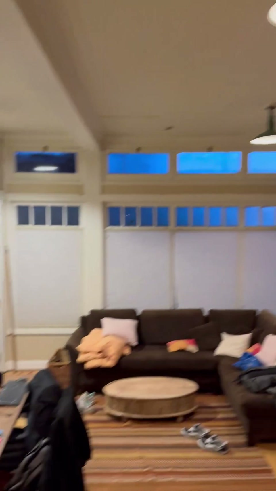](https://video.twimg.com/amplify_video/1917059010215481347/vid/avc1/1080x1920/65h2bzglRtHN1VG5.mp4?tag=16)

- Media 1: [highest-resolution MP4](https://video.twimg.com/amplify_video/1917059010215481347/vid/avc1/1080x1920/65h2bzglRtHN1VG5.mp4?tag=16)
- Resolution: 1080×1920 · Duration: 0:10 · Type: video
- [Original X poster](https://pbs.twimg.com/amplify_video_thumb/1917059010215481347/img/azG1WIEZ7-ooxgQ-.jpg)

### 2025-04-28 · reply · [Post 1916940648579797095](https://x.com/francedot/status/1916940648579797095)

> @Prince_Canuma @XLearning969 @awnihannun 6-bit: https://t.co/GKK2BGBzuK

[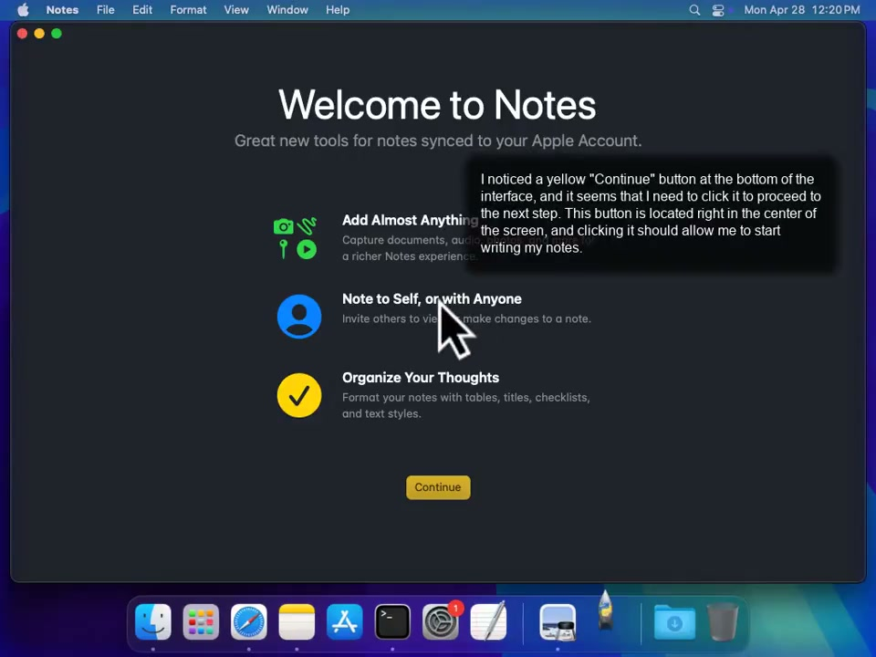](https://video.twimg.com/amplify_video/1916940629378203648/vid/avc1/960x720/qWITHkYrrA3j-8lr.mp4?tag=16)

- Media 1: [highest-resolution MP4](https://video.twimg.com/amplify_video/1916940629378203648/vid/avc1/960x720/qWITHkYrrA3j-8lr.mp4?tag=16)
- Resolution: 960×720 · Duration: 0:01 · Type: video
- [Original X poster](https://pbs.twimg.com/amplify_video_thumb/1916940629378203648/img/ojWQNmGujO_3XKBV.jpg)

### 2025-04-28 · reply · [Post 1916940595677040903](https://x.com/francedot/status/1916940595677040903)

> @Prince_Canuma @XLearning969 @awnihannun 4-bit: https://t.co/hgxoHJ2EsQ

- Media 1: [highest-resolution MP4](https://video.twimg.com/amplify_video/1916940575947042816/vid/avc1/960x720/AsBHtJiQyRITfoJG.mp4?tag=16)
- Resolution: 960×720 · Duration: 0:02 · Type: video
- [Original X poster](https://pbs.twimg.com/amplify_video_thumb/1916940575947042816/img/usATWeQ_TlKFf2eo.jpg)

### 2025-04-25 · reply · [Post 1915904388297855346](https://x.com/francedot/status/1915904388297855346)

> @Prince_Canuma @XLearning969 @awnihannun https://t.co/uSCqzXagIW

- Media 1: [highest-resolution MP4](https://video.twimg.com/tweet_video/Gpao4nebEAIpQhq.mp4)
- Resolution: 454×240 · Duration: 0:02 · Type: animated_gif
- [Original X poster](https://pbs.twimg.com/tweet_video_thumb/Gpao4nebEAIpQhq.jpg)

### 2025-04-19 · reply · [Post 1913725688764637306](https://x.com/francedot/status/1913725688764637306)

> @_saracasta https://t.co/ycJR8TNWtX

- Media 1: [highest-resolution MP4](https://video.twimg.com/tweet_video/Go7rXoCaoAA_aiW.mp4)
- Resolution: 498×456 · Duration: 0:02 · Type: animated_gif
- [Original X poster](https://pbs.twimg.com/tweet_video_thumb/Go7rXoCaoAA_aiW.jpg)

### 2025-04-19 · reply · [Post 1913660571221967297](https://x.com/francedot/status/1913660571221967297)

> @dhruv2038 https://t.co/t7huOnsgXT

- Media 1: [highest-resolution MP4](https://video.twimg.com/tweet_video/Go6wJBMa0AAGYUI.mp4)
- Resolution: 498×452 · Duration: 0:02 · Type: animated_gif
- [Original X poster](https://pbs.twimg.com/tweet_video_thumb/Go6wJBMa0AAGYUI.jpg)

### 2025-04-11 · reply · [Post 1910743294377943184](https://x.com/francedot/status/1910743294377943184)

> @tom_doerr https://t.co/GZoJwvGLLx

- Media 1: [highest-resolution MP4](https://video.twimg.com/tweet_video/GoRS5beakAAfW4Z.mp4)
- Resolution: 480×270 · Duration: 0:01 · Type: animated_gif
- [Original X poster](https://pbs.twimg.com/tweet_video_thumb/GoRS5beakAAfW4Z.jpg)

### 2025-04-06 · [Post 1908729156327596396](https://x.com/francedot/status/1908729156327596396)

> blessed https://t.co/jhxmBFObE3

- Media 1: [highest-resolution MP4](https://video.twimg.com/amplify_video/1908729091672743936/vid/avc1/1080x1920/lBWUpUceZRzPdeWB.mp4?tag=16)
- Resolution: 1080×1920 · Duration: 0:06 · Type: video
- [Original X poster](https://pbs.twimg.com/amplify_video_thumb/1908729091672743936/img/wRUvXRR09gZ0wCik.jpg)

### 2025-01-09 · [Post 1877446990092505354](https://x.com/francedot/status/1877446990092505354)

> Awesome Agents for Computer Use just hit over 300 stars in just a few days! It's amazing to see how much interest there is in these Computer Use scenarios. Thank you to everyone who reached out or submitted a PR - I really appreciate your support! https://t.co/aINfN6naId

- Media 1: [highest-resolution MP4](https://video.twimg.com/ext_tw_video/1877446005131460608/pu/vid/avc1/1280x720/P1FzBEaLofGAGkpA.mp4?tag=12)
- Resolution: 1280×720 · Duration: 0:04 · Type: video
- [Original X poster](https://pbs.twimg.com/ext_tw_video_thumb/1877446005131460608/pu/img/mY0oBwxrJh6Fp858.jpg)

### 2025-01-05 · reply · [Post 1875812607892058479](https://x.com/francedot/status/1875812607892058479)

> @namedobject https://t.co/Xpy1rhgPFh

- Media 1: [highest-resolution MP4](https://video.twimg.com/tweet_video/Ggg5nyyXkAACXKO.mp4)
- Resolution: 220×124 · Duration: 0:03 · Type: animated_gif
- [Original X poster](https://pbs.twimg.com/tweet_video_thumb/Ggg5nyyXkAACXKO.jpg)

### 2024-10-27 · [Post 1850678286499926412](https://x.com/francedot/status/1850678286499926412)

> Corp land today https://t.co/ZovhCalFNF

- Media 1: [highest-resolution MP4](https://video.twimg.com/amplify_video/1850677826996871168/vid/avc1/1080x1920/gAjMyWVwSXkA4DA1.mp4?tag=16)
- Resolution: 1080×1920 · Duration: 0:13 · Type: video
- [Original X poster](https://pbs.twimg.com/amplify_video_thumb/1850677826996871168/img/QIsK8q8rIcTY-kBf.jpg)

### 2024-10-23 · [Post 1849216576370708627](https://x.com/francedot/status/1849216576370708627)

> Desktop and mobile control capabilities of Claude are great, but they're not new or exclusive to Anthropic's models. The community has been building interface agents since November last year. Check out a demo of a real iOS device (not an emulator!) being controlled by an AI agent https://t.co/P33XTfCI6n

[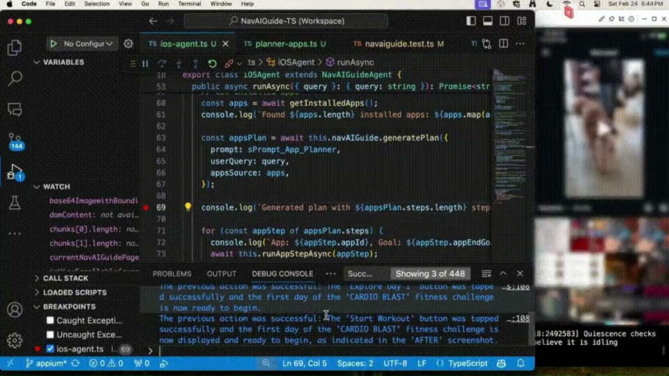](https://video.twimg.com/tweet_video/Gam6AsvWwAAI2Mz.mp4)

- Media 1: [highest-resolution MP4](https://video.twimg.com/tweet_video/Gam6AsvWwAAI2Mz.mp4)
- Resolution: 1000×562 · Duration: 2:03 · Type: animated_gif
- [Original X poster](https://pbs.twimg.com/tweet_video_thumb/Gam6AsvWwAAI2Mz.jpg)

### 2024-10-01 · reply · [Post 1841164012689444911](https://x.com/francedot/status/1841164012689444911)

> @MSFTCopilot https://t.co/vujZltspbS

- Media 1: [highest-resolution MP4](https://video.twimg.com/tweet_video/GY0g6G7XoAA4HCp.mp4)
- Resolution: 498×328 · Duration: 0:02 · Type: animated_gif
- [Original X poster](https://pbs.twimg.com/tweet_video_thumb/GY0g6G7XoAA4HCp.jpg)

### 2024-09-19 · [Post 1836760819637408228](https://x.com/francedot/status/1836760819637408228)

> What if resumes could speak? Would you prefer listening to a candidate's story instead of scrolling through a bunch of tech keywords? Here's mine fed to NotebookLM. Pretty impressive, I'd say! It's not every day that you find two podcasters vouching for your accomplishments! https://t.co/OSegDfG9Jc

- Media 1: [highest-resolution MP4](https://video.twimg.com/ext_tw_video/1836759630195605505/pu/vid/avc1/854x480/PLI6220lTa5Fb2fN.mp4?tag=12)
- Resolution: 854×480 · Duration: 9:38 · Type: video
- [Original X poster](https://pbs.twimg.com/ext_tw_video_thumb/1836759630195605505/pu/img/lSK2iNooX0uun4jp.jpg)

### 2024-05-01 · reply · [Post 1785761163671687223](https://x.com/francedot/status/1785761163671687223)

> 2) Get assistance downloading apps from the Windows Store. https://t.co/dIOkUtD0CS

[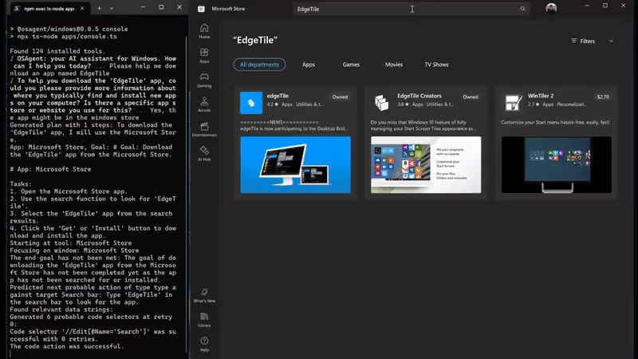](https://video.twimg.com/tweet_video/GMhMTGdWgAAiVbq.mp4)

- Media 1: [highest-resolution MP4](https://video.twimg.com/tweet_video/GMhMTGdWgAAiVbq.mp4)
- Resolution: 800×450 · Duration: 1:00 · Type: animated_gif
- [Original X poster](https://pbs.twimg.com/tweet_video_thumb/GMhMTGdWgAAiVbq.jpg)

### 2024-05-01 · reply · [Post 1785761052405252566](https://x.com/francedot/status/1785761052405252566)

> 1) Research drop-shipping trends through the TikTok app with the help of an agent. https://t.co/3QvHce12Va

[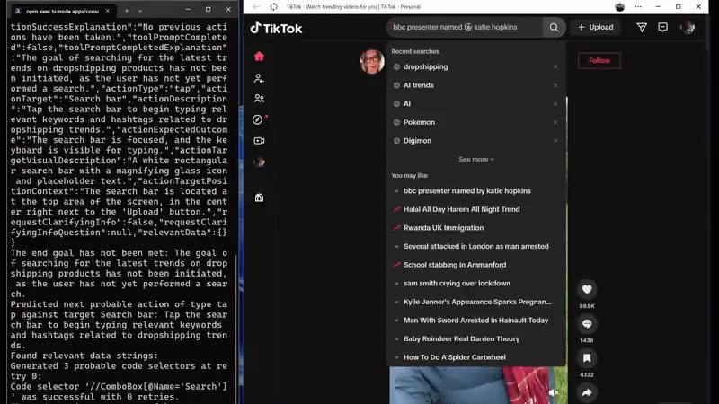](https://video.twimg.com/tweet_video/GMhMKrhWgAAcpnt.mp4)

- Media 1: [highest-resolution MP4](https://video.twimg.com/tweet_video/GMhMKrhWgAAcpnt.mp4)
- Resolution: 800×450 · Duration: 0:59 · Type: animated_gif
- [Original X poster](https://pbs.twimg.com/tweet_video_thumb/GMhMKrhWgAAcpnt.jpg)

### 2024-02-25 · [Post 1761870838083551447](https://x.com/francedot/status/1761870838083551447)

> Imagine if language models could tap into the app ecosystem of your iPhone. Would the need for plugins and assistants become obsolete if we simply allowed a model to orchestrate our existing (and many years robust) user interfaces?  This demonstrates the extent to which GPT-4V https://t.co/8eVW5mGv67

- Media 1: [highest-resolution MP4](https://video.twimg.com/ext_tw_video/1761870173974220800/pu/vid/avc1/1280x720/PDLbuVUnlRNNFtn3.mp4?tag=12)
- Resolution: 1280×720 · Duration: 2:03 · Type: video
- [Original X poster](https://pbs.twimg.com/ext_tw_video_thumb/1761870173974220800/pu/img/FZKr0fhq7jgaobo_.jpg)

### 2024-02-04 · [Post 1754228821547504123](https://x.com/francedot/status/1754228821547504123)

> Thought #typescript deserved some love in the quest for autonomous web navigation, so here's a NavAIGuide-TS: https://t.co/Zue4jqjJYR. Turns out 1 call to #GPT4-V + plain GPT 3.5 Turbo JSON Mode + reasoning and retry feedback loops 'is almost all you need' #GPT #aiagents #LLMs https://t.co/9suOJMfO2c

[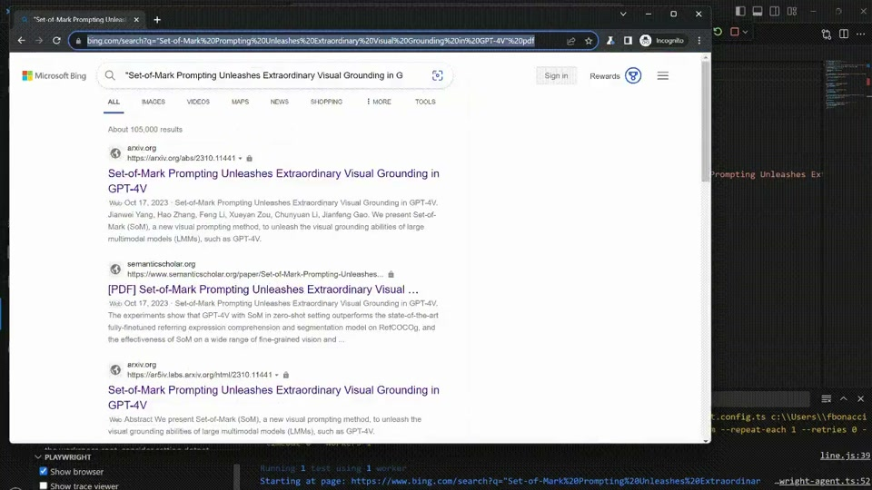](https://video.twimg.com/tweet_video/GFg-1kAXsAE92M8.mp4)

- Media 1: [highest-resolution MP4](https://video.twimg.com/tweet_video/GFg-1kAXsAE92M8.mp4)
- Resolution: 1280×720 · Duration: 0:44 · Type: animated_gif
- [Original X poster](https://pbs.twimg.com/tweet_video_thumb/GFg-1kAXsAE92M8.jpg)

### 2021-10-27 · reply · [Post 1453342545258459136](https://x.com/francedot/status/1453342545258459136)

> @Microsoft https://t.co/fGZGmJLn3K

- Media 1: [highest-resolution MP4](https://video.twimg.com/tweet_video/FCtPVh1WEAE5voM.mp4)
- Resolution: 350×250 · Duration: 0:02 · Type: animated_gif
- [Original X poster](https://pbs.twimg.com/tweet_video_thumb/FCtPVh1WEAE5voM.jpg)

### 2020-03-09 · reply · [Post 1236994112110448640](https://x.com/francedot/status/1236994112110448640)

> @_FrancescoVB @qmatteoq https://t.co/HfiD1LkbqA

- Media 1: [highest-resolution MP4](https://video.twimg.com/tweet_video/ESqvlFtWsAEfP6t.mp4)
- Resolution: 480×350 · Duration: 0:07 · Type: animated_gif
- [Original X poster](https://pbs.twimg.com/tweet_video_thumb/ESqvlFtWsAEfP6t.jpg)

### 2019-12-13 · reply · [Post 1205400550034018304](https://x.com/francedot/status/1205400550034018304)

> @jeffrubenstein https://t.co/gnL3r8JDhZ

- Media 1: [highest-resolution MP4](https://video.twimg.com/tweet_video/ELpxZtMWkAU9ftO.mp4)
- Resolution: 480×266 · Duration: 0:03 · Type: animated_gif
- [Original X poster](https://pbs.twimg.com/tweet_video_thumb/ELpxZtMWkAU9ftO.jpg)

### 2019-07-07 · reply · [Post 1147853687324336135](https://x.com/francedot/status/1147853687324336135)

> @kandapik https://t.co/zo0GEKR8v1

- Media 1: [highest-resolution MP4](https://video.twimg.com/tweet_video/D-3-1Y4WkAEXTHG.mp4)
- Resolution: 500×200 · Duration: 0:02 · Type: animated_gif
- [Original X poster](https://pbs.twimg.com/tweet_video_thumb/D-3-1Y4WkAEXTHG.jpg)

### 2018-08-31 · [Post 1035629959518113792](https://x.com/francedot/status/1035629959518113792)

> No ordinary jog today! @YesTheory this is my 1 mile run for #YesTheoryRunsTheWorld #WhatsYourJump https://t.co/iExEek0NeF

- Media 1: [highest-resolution MP4](https://video.twimg.com/ext_tw_video/1035629601144426497/pu/vid/720x1280/YKRDcYTzq6Px-CyR.mp4?tag=5)
- Resolution: 720×1280 · Duration: 0:13 · Type: video
- [Original X poster](https://pbs.twimg.com/ext_tw_video_thumb/1035629601144426497/pu/img/erLi0jFk8F_EQ1wV.jpg)

### 2018-06-21 · reply · [Post 1009823502713618436](https://x.com/francedot/status/1009823502713618436)

> @jeremiahmarble @justinxinliu  https://t.co/6stnvq0Bb2

- Media 1: [highest-resolution MP4](https://video.twimg.com/tweet_video/DgOdE13X4AE-HTM.mp4)
- Resolution: 358×202 · Duration: 0:06 · Type: animated_gif
- [Original X poster](https://pbs.twimg.com/tweet_video_thumb/DgOdE13X4AE-HTM.jpg)

### 2018-06-08 · reply · [Post 1005145556832915457](https://x.com/francedot/status/1005145556832915457)

> @migueldeicaza  https://t.co/4UcS1c753M

- Media 1: [highest-resolution MP4](https://video.twimg.com/tweet_video/DfL-jA6W0AA43TX.mp4)
- Resolution: 400×224 · Duration: 0:01 · Type: animated_gif
- [Original X poster](https://pbs.twimg.com/tweet_video_thumb/DfL-jA6W0AA43TX.jpg)

### 2018-04-12 · reply · [Post 984384362622930945](https://x.com/francedot/status/984384362622930945)

> @ElaMoscicka @mDevCamp @JamesMontemagno  https://t.co/4o0axviTbg

- Media 1: [highest-resolution MP4](https://video.twimg.com/tweet_video/Dak8WadXcAAzVK3.mp4)
- Resolution: 268×268 · Duration: 0:02 · Type: animated_gif
- [Original X poster](https://pbs.twimg.com/tweet_video_thumb/Dak8WadXcAAzVK3.jpg)

### 2018-03-27 · [Post 978585438746267648](https://x.com/francedot/status/978585438746267648)

> Woow! My small contribution has been shipped with #XamarinForms 3.0.0-pre2 https://t.co/jEhZFZH42h https://t.co/27hYYc53t6

- Media 1: [highest-resolution MP4](https://video.twimg.com/tweet_video/DZSiHu7WsAA6ADO.mp4)
- Resolution: 224×126 · Duration: 0:08 · Type: animated_gif
- [Original X poster](https://pbs.twimg.com/tweet_video_thumb/DZSiHu7WsAA6ADO.jpg)

### 2017-10-07 · [Post 916718544406106112](https://x.com/francedot/status/916718544406106112)

> Che bello vedere ragazzi del 99 a lavoro per realizzare la LORO #18app. Ecco la storia del team @newhorizon_dev ad #hackdev17 @CodemotionIT https://t.co/G6fiWekmz0

- Media 1: [highest-resolution MP4](https://video.twimg.com/ext_tw_video/916717419871309825/pu/vid/352x640/96nelFwNPA56uZIy.mp4)
- Resolution: 352×640 · Duration: 0:07 · Type: video
- [Original X poster](https://pbs.twimg.com/ext_tw_video_thumb/916717419871309825/pu/img/qVn7x5PUkYl2tszf.jpg)

### 2017-03-19 · [Post 843566245337284611](https://x.com/francedot/status/843566245337284611)

> Please don't block your UI Thread!  Just a sneak peek from my "#xamarinforms Tips &amp; Tricks" session at #Codemotion Rome next 24 March! https://t.co/0JNYUhNo0c

- Media 1: [highest-resolution MP4](https://video.twimg.com/ext_tw_video/843564747878514689/pu/vid/180x320/VoG8-z5mn_VT9NHw.mp4)
- Resolution: 180×320 · Duration: 0:05 · Type: video
- [Original X poster](https://pbs.twimg.com/ext_tw_video_thumb/843564747878514689/pu/img/1YJBwDzhHXhazUsw.jpg)
